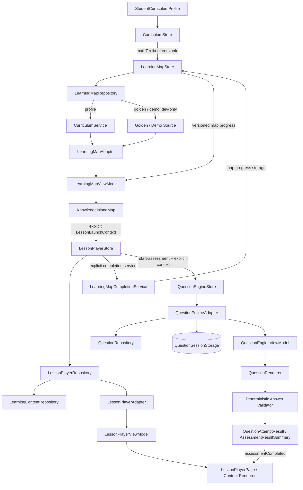

# 知识岛｜工程架构与 PHASE 9 边界

> 本文档记录当前 Vue 3 工程的模块边界和 PHASE 7～9 实现。它不是数据库架构或部署方案；课程事实、审核状态和题目协议仍分别以 `DATA_MODEL.md`、`CONTENT_REVIEW.md` 和 `QUESTION_SCHEMA.md` 为准。

## 文档状态

| 项目 | 内容 |
| --- | --- |
| 当前阶段 | PHASE 9.4：Question Engine / Assessment |
| 状态 | PHASE 7 地图、PHASE 8 LessonPlayer 与 PHASE 9 Question Engine 已实现并验证；PHASE 9 完成后停止 |
| 技术栈 | Vue 3、TypeScript strict、Vite、Pinia、Vue Router、Vitest |
| 生产原则 | 生产课程数据只允许 `verificationStatus = REVIEWED` |
| 开发原则 | SAMPLE / UNVERIFIED 只在显式开发数据集显示，并必须有警示 |

## 1. 分层

```text
src/
├─ types/
│  ├─ domain.ts                         # Curriculum / 内容 / 学习行为类型
│  └─ learning-map.ts                   # 地图 Presentation / Progress 类型
├─ data/
│  ├─ curriculum/                       # SAMPLE 与 Golden Curriculum 输入
│  └─ learning-map/demo/                # 多岛地图视觉夹具
├─ services/
│  ├─ curriculum/                       # 导入、核验、访问策略
│  ├─ adapters/mock/curriculumMockAdapter.ts
│  └─ learning-map/                     # source、adapter、layout、unlock、storage、repository
│  └─ lesson-player/                    # content、adapter、repository、session、地图完成接口
│  └─ question-engine/                  # repository、adapter、validator、session storage
├─ stores/
│  ├─ curriculumStore.ts                 # 地区 / 年级 / 学期 / 三科教材 / profile
│  └─ learningMapStore.ts                # 地图 source、选择、聚焦、演示进度
│  └─ lessonPlayerStore.ts               # 学习上下文、ViewModel、会话和步骤状态
│  └─ questionEngineStore.ts             # Assessment、题目草稿、提交和结果状态
├─ components/learning-map/              # 地图视觉壳与可访问交互
├─ components/lesson-player/             # 内容块渲染与媒体回退
├─ components/question-engine/            # 六类题型渲染、媒体与反馈
├─ pages/
│  ├─ LearningMapPage.vue                # 正式 /learning-map
│  ├─ DevLearningMapPage.vue             # 开发数据集与状态 Showcase
│  ├─ LessonPlayerPage.vue               # 正式 /lesson 与开发 /dev/lesson-player
│  └─ QuestionEnginePage.vue             # 正式 /assessment 与开发 /dev/question-engine
└─ styles/                               # 地图与学习步骤场景、状态和响应式样式
```

## 2. 责任边界

| 层 | 权威 / 责任 | 禁止承担 |
| --- | --- | --- |
| Curriculum Domain | 教材、Unit、Lesson、KnowledgePoint、关系、来源与核验 | 视觉坐标、岛屿主题、地图完成度 |
| Curriculum Service | 按地区 / 学段查询和生产访问保护 | Vue 组件关系拼装、地图状态 |
| LearningMap Source | 为地图提供不含视觉字段的课程快照 | 猜教材、修改课程数据 |
| LearningMap Adapter | 生成 UnitIsland、LessonMapSection、KnowledgeMapNode、Connection 和诊断 | LessonPlayer 内容、Question、Mastery 算法 |
| LearningMap Store | 地图加载、选择、聚焦和开发演示进度 | 修改教材或 StudentCurriculumProfile |
| LessonPlayer Repository / Adapter | 校验 `LessonLaunchContext`，读取课程内容并生成 LessonPlayer ViewModel | 猜教材、绕过内容审核、拼接题目或掌握度 |
| LessonPlayer Store | 学习会话、步骤导航、恢复、完成和独立会话存储 | Question Engine、作答评分、Mastery、Reward |
| LessonPlayer Completion Service | 通过稳定上下文把已完成学习映射到地图进度 | 直接依赖或修改 `learningMapStore` |
| Question Repository / Adapter | 依据显式 `AssessmentLaunchContext` 读取固定题目集合、关系和审核状态 | 随机抽题、猜教材、模型推荐、写入掌握度 |
| Question Engine Store | 题目草稿、提交锁定、QuestionSession、恢复和 Assessment 结果 | 修改 Question 本体、Mastery、KnowledgeEnergy、WrongBook、Reward |
| Question Renderer / Validator | 渲染结构化题目并按数据规则确定性判题 | `v-html`、AI 判题、隐式部分分或隐式学习事件 |
| LearningMap Components | 呈现地图、连接线、状态、详情面板和可访问交互 | 读取原始 Curriculum 数组、推断课程事实 |
| LessonPlayer Components | 呈现 ViewModel 内容块、媒体 fallback 和非评分互动 | `v-html`、答案提交、自动判题 |
| Router / Pages | 入口保护、数据集选择和状态展示 | 绕过生产访问策略 |

## 3. 运行数据流



正式地图只走 `profile` 数据集，开发页才可以切换 `golden` / `demo`。`LearningMapViewModel` 是地图页面唯一输入；`LessonPlayerViewModel` 是学习页面唯一输入。两个 ViewModel 把课程事实、地图展示状态和学习会话分开，避免页面重复做关系查询。

## 4. PHASE 7 模块

### 4.1 Curriculum source 与 Adapter

`curriculumSource.ts` 将 Domain 或 Golden Import Package 转为 `LearningMapCurriculumSource`。该输入保留稳定 ID、标题、排序、关系和 `isSample` / `verificationStatus`，不包含 `position`、`theme`、URL 或 CSS。

`learningMapAdapter.ts` 负责：排序、节点 ID 生成、前置索引、连接线端点、视觉注册表、稳定布局、进度套用和缺失引用诊断。

### 4.2 纯函数

- `learningMapLayout.ts`：相同输入产生相同逻辑坐标。
- `learningMapProgress.ts`：计算节点、Lesson、Unit 和地图完成度。
- `learningMapUnlock.ts`：根据稳定 KnowledgePoint ID 解析锁定 / 可用 / 进行中 / 完成。
- `learningMapStorage.ts`：读取 / 写入版本化地图进度载荷。

`mastered` / `perfect` 不在纯函数中由分数产生；它们只能作为已有 fixture / mock 状态被保留。

## 5. PHASE 8 LessonPlayer 模块

### 5.1 领域与状态

`LessonStep` 是最小导航单位，`LessonSession` 是学生在一个完整课程上下文中的本地可恢复状态。会话 ID 按 `studentId + textbookId + unitId + lessonId + knowledgePointId` 确定性生成，不使用 `Math.random()` 或 `Date.now()` 作为身份。会话载荷独立存放为 `{ schemaVersion: 1, sessions }`，不写入 `learningMapStore`。

`LessonPlayerRepository` 先验证 Textbook → Unit → Lesson → KnowledgePoint → LessonKnowledgePoint 映射，再读取 `LearningContent`。Curriculum 已 `REVIEWED` 但 LearningContent 未 `REVIEWED` 时仍不可用于正式入口；开发页可在显式配置下查看 SAMPLE / UNVERIFIED 并显示警示。

### 5.2 内容渲染

`LessonContentRenderer` 根据 `LessonContentBlockViewModel.type` 注册 Intro、Concept、Explanation、Example、Media、Interactive、Practice 和 Summary 组件，未知类型显示开发诊断占位。渲染器只使用安全文本节点与显式媒体属性，不使用 `v-html`；互动不表达答案、评分或正确 / 错误结果。

### 5.3 页面与完成联动

正式 `/lesson` 只接受显式的四个上下文 ID，开发 `/dev/lesson-player` 提供 Demo Fixture 与状态 Showcase。页面支持加载、空内容、暂未开放、错误、Sample、Unverified、恢复和完成状态；完成时调用独立 `LearningMapCompletionService`，服务写入地图进度存储，之后返回地图并聚焦原节点。

## 6. 入口与访问保护

| 入口 | 作用 | 访问边界 |
| --- | --- | --- |
| `/learning-map` | 学生正式地图入口 | 需要已完成 profile；课程 Service 只允许生产可读数据 |
| `/dev/learning-map` | Golden / Demo 预览 | 开发工具，显示 SAMPLE / UNVERIFIED 警示 |
| `/dev/learning-map/states` | 六种节点状态 Showcase | 开发工具，mastered / perfect 仅为 fixture |
| `/map/:mapId` | 历史兼容入口 | 重定向到 `/learning-map`，不另建地图状态 |

没有 profile 时正式入口由路由保护回到 Onboarding；没有可用 source 时页面进入 `not_available` / `empty` 等可恢复状态。Golden 不作为正式回退。

## 7. PHASE 9 Question Engine 模块

### 7.1 领域与读取

`QuestionEngineAdapter` 接受显式 `AssessmentLaunchContext`，先校验课程上下文，再通过 `QuestionRepository` 读取 `AssessmentDefinition.questionIds` 和 `QuestionKnowledgePoint` 关系。Demo Assessment 是固定六题顺序；正式数据继续服从 Question 独立审核闸门。页面不根据地区、标题或题面猜测教材与知识点。

### 7.2 会话与判题

`questionEngineStore` 通过独立 `questionSessionStorage` 保存草稿、提交状态、结果、题目版本和当前位置。`QuestionRenderer` 只消费 `QuestionViewModel`；`answerValidator` 负责选择、多选、判断、填空、计算和简答的确定性结果。提交后输入锁定，简答题标记人工审核，不自动产生 `MasteryEvent`。

### 7.3 明确隔离

Assessment 结果只返回 Question Engine 与 LessonPlayer；不写入 `KnowledgeMastery`、`KnowledgeEnergy`、`WrongQuestion` 或 `Reward`。`masteryScore` 不做时间衰减，遗忘 / 复习提醒仍由 `KnowledgeEnergy` 独立负责。

## 8. 质量边界

PHASE 7 已覆盖适配器、布局、解锁、存储、空态 / unsupported、Sample / Unverified 标识、组件可访问性、Reduced Motion、响应式和浏览器冒烟。PHASE 8 继续覆盖 LessonPlayer 领域、会话存储、内容块渲染、状态 Showcase、地图回链、响应式与浏览器冒烟。测试和验证结果见 `LEARNING_MAP.md`、`LEARNING_MAP_VISUAL.md`、`LESSON_PLAYER.md` 和 `LESSON_SESSION.md`。

PHASE 9 已覆盖 Question Domain、固定 Assessment、六类题型渲染、确定性判题、草稿与结果恢复、生产题目闸门、LessonPlayer 回链、Sample / Unverified 状态、响应式、键盘可访问性、结果语义和 Reduced Motion。验证记录见 `QUESTION_ENGINE.md`、`QUESTION_SESSION.md`、`QUESTION_VALIDATION.md`、`ASSESSMENT.md` 与 `LESSON_PLAYER.md`。

PHASE 9 已完成并停止。当前不实现 `MasteryScore`、`KnowledgeEnergy`、Adaptive Learning、WrongBook、Reward、AI Question Generation、AI Grading 或 PHASE 10 能力。
