# 知识岛课程与学习数据模型

> 本文档定义课程、内容与学习行为实体的字段、关系和数据边界，并记录 PHASE 7 地图、PHASE 8 LessonPlayer、PHASE 9 Question Engine 与 PHASE 10 Mastery 的隔离规则。它是数据模型设计，不是数据库迁移文件；实现状态以文档状态表、`QUESTION_SCHEMA.md` 和 `MASTERY.md` 为准。

## 文档状态

| 项目 | 内容 |
| --- | --- |
| 所属阶段 | PHASE 10.4：Mastery Model（继承 PHASE 2.2、PHASE 6～9 数据契约） |
| 状态 | 数据契约、SAMPLE 管线、导入 Schema、来源追踪、完整性校验、Golden Framework、生产闸门、地图展示投影、LessonPlayer 内容读取、QuestionKnowledgePoint 关系、Assessment、QuestionSession、LearningEvidence、MasteryRecord 和确定性 Mastery Engine 已实现并验证 |
| 上游事实源 | `PRODUCT.md`；课程层级规则见 `CURRICULUM.md` |
| 下游消费者 | 题目协议、内容审核、MVP 课程占位数据、后续 API / 数据库设计 |
| 权威维护者 | 数据 / 教研负责人（待确定） |
| 实现状态 | `src/types`、`src/data/curriculum`、`src/services/curriculum`、`curriculumService`、`curriculumStore`、档案仓储、校验器、`src/services/learning-map`、`src/services/lesson-player`、`src/services/question-engine` 和 `src/services/mastery` 已实现；真实课程数据仍未核验 |

---

## 1. 模型总则

### 1.1 标识与时间

- 每个实体使用不可变的 `id` 作为稳定标识；显示名称不是身份。
- 关系表使用明确的字段名，如 `lessonId`、`knowledgePointId`，禁止使用含义不清的单一 `id`。
- 时间字段使用带时区的 ISO 8601 时间；业务日期（如每日任务日期）单独使用本地日期字段。
- 内容、来源、审核和版本记录默认保留历史，不通过物理删除抹去事实。
- `status` 表示生命周期；`needsVerification` 表示事实或来源是否仍需人工核验，两者不能互相替代。
- `verificationStatus` 表示课程事实核验阶段：`SAMPLE`、`UNVERIFIED`、`VERIFIED`、`REVIEWED`、`REJECTED`；它与实体 `status` 属于不同状态族。
- 各实体的状态族与迁移规则统一见 `CONTENT_REVIEW.md` 的 `LIFECYCLE_MATRIX`；结构实体使用 `ACTIVE`，内容与题目使用 `PUBLISHED`，两者不互换。

### 1.2 课程关系与体验关系

课程层级关系是内容域的权威关系：

```text
Grade → Semester / Subject → TextbookVersion → Unit → Lesson
Lesson ↔ KnowledgePoint → CourseContent / Question
```

地区与教材的可用性关系属于课程选择域，不改变课程主链：

```text
Region → RegionTextbookRelation → TextbookVersion
TextbookVersion → Grade / Semester / Subject
```

`Region` 表示行政或产品适用地区，不是教材版本，也不是 `Grade`、`KnowledgePoint` 或课程内容的父级。禁止设计成 `Region → Grade → KnowledgePoint`。

地图关系是学习体验域的投影：

```text
LearningMap → MapNode
MapNode ↔ KnowledgePoint
MapNode ↔ CourseContent
MapNode ↔ Question
```

学生进度、掌握度、错题和奖励属于学习行为域，不能反向修改课程层级、教材版本或内容审核事实。

### 1.3 字段约束约定

字段表中的“权威性”含义如下：

- `权威`：该字段是该关系或事实的唯一来源。
- `引用`：字段指向另一个实体的权威记录。
- `快照`：为了查询或索引复制的值，可被权威记录重新生成。
- `派生`：由其他字段计算出的读取结果，不应作为独立事实覆盖来源。
- `配置`：由产品或内容负责人配置的规则，不能在页面中写死。

---

## 2. 课程与选课范围实体

### 2.1 Grade

| 字段 | 类型 | 必填 | 权威性 | 说明 |
| --- | --- | --- | --- | --- |
| `id` | ID | 是 | 权威 | 年级稳定标识 |
| `code` | string | 是 | 权威 | `G1`～`G6` 等规范编码 |
| `name` | string | 是 | 权威 | 显示名称，可本地化 |
| `sortOrder` | integer | 是 | 权威 | 展示顺序 |
| `status` | enum | 是 | 权威 | `DRAFT`、`ACTIVE`、`ARCHIVED` |

### 2.2 Semester

| 字段 | 类型 | 必填 | 权威性 | 说明 |
| --- | --- | --- | --- | --- |
| `id` | ID | 是 | 权威 | 学期稳定标识 |
| `code` | enum | 是 | 权威 | `UPPER`、`LOWER` |
| `name` | string | 是 | 权威 | 上册、下册等显示名称 |
| `sortOrder` | integer | 是 | 权威 | 学期顺序 |
| `status` | enum | 是 | 权威 | `DRAFT`、`ACTIVE`、`ARCHIVED` |

### 2.3 Subject

| 字段 | 类型 | 必填 | 权威性 | 说明 |
| --- | --- | --- | --- | --- |
| `id` | ID | 是 | 权威 | 学科稳定标识 |
| `code` | enum | 是 | 权威 | `CHINESE`、`MATH`、`ENGLISH` |
| `name` | string | 是 | 权威 | 学科显示名称 |
| `themeKey` | string | 是 | 配置 | 学科主题配置键，不是教材名称 |
| `status` | enum | 是 | 权威 | `DRAFT`、`ACTIVE`、`ARCHIVED` |

### 2.4 TextbookVersion

| 字段 | 类型 | 必填 | 权威性 | 说明 |
| --- | --- | --- | --- | --- |
| `id` | ID | 是 | 权威 | 教材版本稳定标识 |
| `subjectId` | ID | 是 | 引用 | 关联 `Subject` |
| `gradeId` | ID | 是 | 引用 | 关联 `Grade` |
| `semesterId` | ID | 是 | 引用 | 关联 `Semester` |
| `publisherId` | ID | 是 | 引用 | 关联 `Publisher`；出版社事实独立维护 |
| `versionName` | string | 是 | 权威 | 正式版本名；不得只使用“某某版”简称 |
| `editionYear` | string / integer | 否 | 权威 | 未知时为待核验，不得凭记忆补全 |
| `curriculumStandard` | string / ID | 否 | 引用 | 课程标准或其来源标识 |
| `sourceId` | ID | 是 | 引用 | 关联 `ContentSource` |
| `status` | enum | 是 | 权威 | `DRAFT`、`ACTIVE`、`ARCHIVED` |
| `needsVerification` | boolean | 是 | 权威 | 版本信息是否需要核验 |
| `verificationStatus` | enum | 是 | 权威 | `SAMPLE`、`UNVERIFIED`、`VERIFIED`、`REVIEWED`、`REJECTED` |
| `createdAt` / `updatedAt` | datetime | 是 | 记录 | 创建与更新时间 |

教材版本不保存 `publisher: string` 或权威的 `regionScope: string`。地区适用范围由 `RegionTextbookRelation` 表达；如果 API 为展示需要返回 `regionScope`，它只能是根据有效关系生成的派生字段，不能作为筛选、审核或发布的权威关系。教材版本可以被多个地区复用，也可以在不同学科中使用不同版本。

教材版本的结构生命周期由 `status` 表达，事实核验由 `verificationStatus`、`needsVerification`、来源和审核记录表达。只有满足产品发布规则的版本才能进入生产解析；`publisherId` 指向的 `Publisher` 也必须存在并满足相应核验要求。

### 2.5 Unit

| 字段 | 类型 | 必填 | 权威性 | 说明 |
| --- | --- | --- | --- | --- |
| `id` | ID | 是 | 权威 | 单元稳定标识 |
| `textbookVersionId` | ID | 是 | 引用 | 所属教材版本 |
| `code` | string | 是 | 权威 | 版本内唯一单元编码 |
| `title` | string | 是 | 权威 | 单元名称；未核验时使用占位名 |
| `sortOrder` | integer | 是 | 权威 | 版本内顺序 |
| `sceneKey` | string | 否 | 配置 | 地图场景键，不等同于教材名称 |
| `status` | enum | 是 | 权威 | `DRAFT`、`ACTIVE`、`ARCHIVED` |
| `needsVerification` | boolean | 是 | 权威 | 单元信息是否需要核验 |
| `sourceId` | ID | 是 | 引用 | 单元来源 |
| `verificationStatus` | enum | 是 | 权威 | 课程事实核验阶段 |

### 2.6 Lesson

| 字段 | 类型 | 必填 | 权威性 | 说明 |
| --- | --- | --- | --- | --- |
| `id` | ID | 是 | 权威 | 课次稳定标识 |
| `unitId` | ID | 是 | 引用 | 所属单元 |
| `code` | string | 是 | 权威 | 单元内唯一课次编码 |
| `title` | string | 是 | 权威 | 课次标题；未知时使用占位名 |
| `sortOrder` | integer | 是 | 权威 | 单元内顺序 |
| `status` | enum | 是 | 权威 | `DRAFT`、`ACTIVE`、`ARCHIVED` |
| `needsVerification` | boolean | 是 | 权威 | 课次信息是否需要核验 |
| `sourceId` | ID | 是 | 引用 | 课次来源 |
| `verificationStatus` | enum | 是 | 权威 | 课程事实核验阶段 |

### 2.7 KnowledgePoint

| 字段 | 类型 | 必填 | 权威性 | 说明 |
| --- | --- | --- | --- | --- |
| `id` | ID | 是 | 权威 | 知识点稳定标识 |
| `code` | string | 是 | 权威 | 知识点库内规范编码 |
| `name` | string | 是 | 权威 | 知识点名称 |
| `subjectId` | ID | 是 | 引用 | 主学科归属 |
| `gradeScope` | `GradeScope` | 是 | 权威 | 可适用的年级范围，可跨年级 |
| `description` | string | 是 | 权威 | 面向内容与教研的定义 |
| `learningObjective` | string[] | 是 | 权威 | 学习目标 |
| `abilityTags` | string[] | 是 | 权威 | 能力标签，如计算、阅读理解等 |
| `difficultyLevel` | enum | 是 | 配置 | 基础、进阶等难度级别 |
| `parentKnowledgePointId` | ID | 否 | 引用 | 知识树直接父节点 |
| `status` | enum | 是 | 权威 | `DRAFT`、`ACTIVE`、`ARCHIVED` |
| `needsVerification` | boolean | 是 | 权威 | 名称、目标或范围是否需要核验 |
| `sourceId` | ID | 是 | 引用 | 知识点来源 |
| `verificationStatus` | enum | 是 | 权威 | 课程事实核验阶段 |

`parentKnowledgePointId` 只表达知识树层级；知识前置条件必须使用 `KnowledgePrerequisite`。

`GradeScope` 的正式结构为：

```ts
interface GradeScope {
  minGrade: number;
  maxGrade: number;
  explicitGradeIds?: Id[];
}
```

约束：`minGrade` 与 `maxGrade` 必须为 1～6 的整数，且 `minGrade <= maxGrade`。`explicitGradeIds` 用于表达非连续或需要精确列举的适用年级；如果存在，数组中的年级必须落在最小 / 最大范围内。

### 2.8 LessonKnowledgePointRelation

| 字段 | 类型 | 必填 | 权威性 | 说明 |
| --- | --- | --- | --- | --- |
| `lessonId` | ID | 是 | 引用 | 课次 |
| `knowledgePointId` | ID | 是 | 引用 | 知识点 |
| `relationType` | enum | 是 | 权威 | `CORE`、`RELATED`、`REVIEW`、`EXTENSION` |
| `order` | integer | 是 | 权威 | 课次内顺序 |
| `isPrimary` | boolean | 是 | 权威 | 是否为课次主知识点 |
| `sourceId` | ID | 是 | 引用 | 关系来源 |
| `needsVerification` | boolean | 是 | 权威 | 关系是否需要核验 |
| `verificationStatus` | enum | 否 | 权威 | 关系事实核验阶段 |

主键建议使用 `(lessonId, knowledgePointId, relationType)` 组合，并要求每个可发布课次至少存在一个已核验的主知识点关系。

### 2.9 KnowledgePrerequisite

| 字段 | 类型 | 必填 | 权威性 | 说明 |
| --- | --- | --- | --- | --- |
| `id` | ID | 是 | 权威 | 前置关系标识 |
| `prerequisiteKnowledgePointId` | ID | 是 | 引用 | 前置知识点 |
| `dependentKnowledgePointId` | ID | 是 | 引用 | 依赖前置知识点的目标 |
| `relationType` | enum | 是 | 权威 | `REQUIRED`、`RECOMMENDED` |
| `sourceId` | ID | 是 | 引用 | 关系依据 |
| `status` | enum | 是 | 权威 | `DRAFT`、`VERIFIED`、`ARCHIVED` |
| `needsVerification` | boolean | 是 | 权威 | 是否待核验 |
| `verificationStatus` | enum | 否 | 权威 | 前置关系事实核验阶段 |

导入、审核和发布前必须检查自依赖、反向循环、跨学科依赖和失效引用。逻辑上该关系应形成有向无环图。

### 2.10 Region

`Region` 表示行政或产品适用地区，是教材选择的筛选维度，不是教材版本，也不是课程内容父级。MVP 主要使用 `PROVINCE`、`CITY` 两级；`parentRegionId` 只表达地区自身的上下级关系。

| 字段 | 类型 | 必填 | 权威性 | 说明 |
| --- | --- | --- | --- | --- |
| `id` | ID | 是 | 权威 | 地区稳定标识 |
| `code` | string | 是 | 权威 | 地区或产品范围编码 |
| `name` | string | 是 | 权威 | 地区名称 |
| `parentRegionId` | ID | 否 | 引用 | 上级地区；根级地区为空 |
| `level` | enum | 是 | 权威 | `COUNTRY`、`PROVINCE`、`CITY`、`DISTRICT` |
| `status` | enum | 是 | 权威 | `DRAFT`、`ACTIVE`、`ARCHIVED` |
| `verificationStatus` | enum | 否 | 权威 | 地区事实核验阶段；SAMPLE 数据必须为 `SAMPLE` |

`Region` 不直接关联 `Grade`、`Subject`、`Unit` 或 `KnowledgePoint`。地区与教材的适用关系必须通过 `RegionTextbookRelation` 表达。

### 2.11 Publisher

`Publisher` 是出版社词典，不是 `ContentSource` 的替代品。它保存教材版本的出版社身份，具体教材来源、版权与核验依据仍由 `sourceId` 指向 `ContentSource`。

| 字段 | 类型 | 必填 | 权威性 | 说明 |
| --- | --- | --- | --- | --- |
| `id` | ID | 是 | 权威 | 出版社稳定标识 |
| `name` | string | 是 | 权威 | 常用显示名称 |
| `shortName` | string | 否 | 权威 | 简称；不得作为唯一身份 |
| `officialName` | string | 是 | 权威 | 官方名称；未知时待核验 |
| `status` | enum | 是 | 权威 | `DRAFT`、`ACTIVE`、`ARCHIVED` |
| `sourceId` | ID | 是 | 引用 | 出版社信息来源 |
| `needsVerification` | boolean | 是 | 权威 | 出版社身份是否待核验 |
| `verificationStatus` | enum | 否 | 权威 | 出版社事实核验阶段 |

`Publisher` 不保存地区适用范围，也不因为被某个 `TextbookVersion` 引用就自动获得已核验状态。

### 2.12 RegionTextbookRelation

`RegionTextbookRelation` 是地区与教材版本之间的独立适用关系。关系本身需要来源和审核，不能因为 `TextbookVersion` 已核验，就推断它适用于某个地区。

| 字段 | 类型 | 必填 | 权威性 | 说明 |
| --- | --- | --- | --- | --- |
| `id` | ID | 是 | 权威 | 关系稳定标识 |
| `regionId` | ID | 是 | 引用 | 地区 |
| `textbookVersionId` | ID | 是 | 引用 | 教材版本 |
| `usageType` | enum | 是 | 权威 | `DEFAULT`、`SUPPORTED`、`OPTIONAL` |
| `effectiveFrom` | date | 是 | 权威 | 关系生效日期 |
| `effectiveTo` | date | 否 | 权威 | 关系失效日期；当前有效时为空 |
| `sourceId` | ID | 是 | 引用 | 地区适用关系来源 |
| `status` | enum | 是 | 权威 | `DRAFT`、`ACTIVE`、`ARCHIVED` |
| `needsVerification` | boolean | 是 | 权威 | 关系是否待核验 |
| `verificationStatus` | enum | 否 | 权威 | 地区教材关系核验阶段；不能由教材版本状态推断 |

含义约束：`DEFAULT` 表示当前默认推荐，`SUPPORTED` 表示确认存在使用，`OPTIONAL` 表示可以选择但不是默认推荐。`effectiveFrom <= effectiveTo`（若存在）；同一地区、年级、学期、学科在同一有效时间内出现多个可用版本时，解析器必须要求学生确认，不能自行猜测。

关系只有在 `status = ACTIVE` 且 `needsVerification = false`、来源可追溯并且关联的地区、出版社和教材版本均可用时，才能被教材解析器读取。

---

## 3. 内容、题目与审核实体

### 3.1 CourseContent

课程正文和题目相关的可组合内容统一使用 `ContentBlock[]`，不把内容协议收窄为单一字符串：

```ts
type Id = string;
type ContentBlockType = "TEXT" | "RICH_TEXT" | "IMAGE" | "AUDIO" | "FORMULA";

interface ContentBlock {
  type: ContentBlockType;
  text?: string;
  mediaAssetId?: Id;
  altText?: string;
}
```

| 字段 | 类型 | 必填 | 权威性 | 说明 |
| --- | --- | --- | --- | --- |
| `id` | ID | 是 | 权威 | 内容稳定标识 |
| `knowledgePointId` | ID | 是 | 引用 | 主要知识归属 |
| `title` | string | 是 | 权威 | 内容标题 |
| `contentType` | enum | 是 | 权威 | `TEXTBOOK`、`EXTENSION`、`REVIEW`、`CHALLENGE` |
| `contentFormat` | enum | 是 | 权威 | `TEXT`、`RICH_TEXT`、`IMAGE`、`AUDIO`、`ANIMATION`、`INTERACTIVE` |
| `body` | structured payload | 是 | 版本化 | 正文或交互配置 |
| `media` | `MediaAssetRef[]` | 否 | 引用 / 版本化 | 只保存 `mediaAssetId`、用途和顺序；资源事实由 `MediaAsset` 保存 |
| `difficulty` | enum | 否 | 配置 | 内容难度 |
| `sourceId` | ID | 是 | 引用 | 内容来源 |
| `needsVerification` | boolean | 是 | 权威 | 内容是否待核验 |
| `status` | enum | 是 | 权威 | `DRAFT`、`AI_GENERATED`、`REVIEWED`、`VERIFIED`、`PUBLISHED`、`REJECTED`、`ARCHIVED` |
| `currentVersion` | integer | 是 | 派生 / 版本 | 当前有效版本号 |
| `isSample` | boolean | 是 | 权威 | 是否仅为演示占位 |
| `verificationStatus` | enum | 否 | 权威 | 内容事实核验阶段；与 `status` 不同 |
| `createdAt` / `updatedAt` | datetime | 是 | 记录 | 时间字段 |

对 `TEXTBOOK` 内容，必须存在已核验的教材范围关系或等价来源链；若内容跨多个版本，不能通过覆盖单一 `textbookVersionId` 来表达，应使用内容范围关系表。

### 3.2 Question

| 字段 | 类型 | 必填 | 权威性 | 说明 |
| --- | --- | --- | --- | --- |
| `id` | ID | 是 | 权威 | 题目稳定标识 |
| `questionType` | enum | 是 | 权威 | 题型协议名称 |
| `stem` | `ContentBlock[]` | 是 | 版本化 | 结构化题干或操作指令 |
| `knowledgePointId` | ID | 否 | 迁移兼容 | 旧的单知识点字段；题目引擎以 `QuestionKnowledgePoint` 关系为权威 |
| `difficulty` | enum | 是 | 权威 | 题目难度 |
| `contentType` | enum | 是 | 权威 | 课本、拓展、复习或挑战 |
| `sourceId` | ID | 是 | 引用 | 题目来源 |
| `status` | enum | 是 | 权威 | `DRAFT`、`AI_GENERATED`、`REVIEWED`、`VERIFIED`、`PUBLISHED`、`REJECTED`、`ARCHIVED` |
| `needsVerification` | boolean | 是 | 权威 | 是否待核验 |
| `estimatedSeconds` | integer | 是 | 配置 | 预计作答秒数 |
| `tags` | string[] | 否 | 权威 | 检索与分析标签 |
| `media` | `QuestionMedia[]` | 否 | 引用 / 版本化 | 只保存 `mediaAssetId`、用途和顺序 |
| `options` | `QuestionOption[]` | 否 | 版本化 | 选项内容使用 `ContentBlock[]` |
| `draggableItems` / `targets` | structured[] | 否 | 版本化 | 拖拽项和目标均使用 `content: ContentBlock[]` |
| `leftItems` / `rightItems` | structured[] | 否 | 版本化 | 匹配项均使用 `content: ContentBlock[]` |
| `items` | structured[] | 否 | 版本化 | 排序项使用 `content: ContentBlock[]` |
| `tokens` | structured[] | 否 | 版本化 | 句子 token 保持 `tokenKey`、`text`、`sortOrder` 纯文字结构 |
| `gradeId` | ID | 否 | 快照 | 从权威课程范围生成的查询快照 |
| `semesterId` | ID | 否 | 快照 | 查询快照 |
| `subjectId` | ID | 否 | 快照 | 查询快照；主学科仍由知识点确认 |
| `textbookVersionId` | ID | 否 | 快照 | 查询快照；严格教材放置由范围关系确认 |
| `snapshotAt` | datetime | 否 | 记录 | 快照生成时间 |
| `snapshotSource` | string | 否 | 记录 | 快照来源版本或计算批次 |
| `questionVersion` | integer | 否 | 版本 | 题目内容版本；作答记录必须保留当时看到的版本 |
| `isSample` | boolean | 是 | 权威 | 是否仅为协议演示或测试夹具 |
| `verificationStatus` | enum | 否 | 权威 | 题目事实核验阶段；与 `status` 不同 |

题目答案必须使用 `QuestionAnswerRule` 等结构化规则，不允许把答案固定为 `answer: string`。题型结构详见 `QUESTION_SCHEMA.md`。

### 3.3 QuestionKnowledgePoint

`QuestionKnowledgePoint` 是题目与知识点的权威多对多关系。一道题可以覆盖多个知识点，但在一个 Assessment 目标上下文中必须能解析到对应关系；`Question.knowledgePointId` 只为旧数据迁移和查询兼容保留，不能作为新引擎的唯一归属事实。

| 字段 | 类型 | 必填 | 权威性 | 说明 |
| --- | --- | --- | --- | --- |
| `id` | ID | 是 | 权威 | 关系标识 |
| `questionId` | ID | 是 | 引用 | 题目 |
| `knowledgePointId` | ID | 是 | 引用 | 知识点 |
| `relationType` | enum | 是 | 权威 | `PRIMARY`、`SECONDARY` |
| `weight` | number | 是 | 配置 / 校验 | `0 < weight <= 1`；同一题全部关系权重总和约等于 `1` |
| `order` | integer | 是 | 配置 | 同一题的知识点关系顺序 |
| `isPrimary` | boolean | 是 | 派生 / 校验 | 是否为题目主关系；每题最多一个主关系 |
| `sourceId` | ID | 是 | 引用 | 关系来源 |
| `status` | enum | 是 | 权威 | `DRAFT`、`ACTIVE`、`ARCHIVED` |
| `needsVerification` | boolean | 是 | 权威 | 关系是否待核验 |
| `verificationStatus` | enum | 否 | 权威 | 关系事实核验阶段 |

新建关系必须有且仅有一个 `PRIMARY` 关系；一个题目可以有多个 `SECONDARY` 关系。关系本身的来源与审核独立于 Question 本体审核。

### 3.4 QuestionOption

| 字段 | 类型 | 必填 | 权威性 | 说明 |
| --- | --- | --- | --- | --- |
| `id` | ID | 是 | 权威 | 选项标识 |
| `questionId` | ID | 是 | 引用 | 所属题目 |
| `optionKey` | string | 是 | 权威 | 选项键或拖拽项键 |
| `content` | `ContentBlock[]` | 是 | 版本化 | 结构化选项内容 |
| `media` | `QuestionMedia[]` | 否 | 引用 / 版本化 | 只保存媒体资源引用、用途和顺序 |
| `sortOrder` | integer | 是 | 权威 | 展示或可操作顺序 |
| `status` | enum | 是 | 权威 | `DRAFT`、`ACTIVE`、`ARCHIVED` |

### 3.5 ContentSource

| 字段 | 类型 | 必填 | 权威性 | 说明 |
| --- | --- | --- | --- | --- |
| `id` | ID | 是 | 权威 | 来源标识 |
| `sourceType` | enum | 是 | 权威 | `TEXTBOOK`、`CURRICULUM_STANDARD`、`TEACHER_CREATED`、`AI_GENERATED`、`PUBLIC_RESOURCE`、`LICENSED_RESOURCE` |
| `title` | string | 是 | 权威 | 来源名称 |
| `publisher` | string | 否 | 权威 | 出版者或组织 |
| `edition` | string | 否 | 权威 | 版次 |
| `sourceRef` | string | 否 | 权威 | 链接、档案号或内部引用 |
| `sourceVersion` | string | 否 | 权威 | 来源版本 |
| `copyrightStatus` | enum | 是 | 权威 | `UNKNOWN`、`PENDING`、`CLEARED`、`RESTRICTED` |
| `license` | string | 否 | 权威 | 授权条款或说明 |
| `attribution` | string | 否 | 权威 | 署名要求 |
| `verifiedAt` | datetime | 否 | 审核记录 | 来源核验时间 |
| `notes` | string | 否 | 记录 | 补充说明 |
| `verificationStatus` | enum | 否 | 权威 | 来源事实核验阶段；与 `copyrightStatus` 和内容生命周期分离 |

来源不能填写“AI 知道”。`AI_GENERATED` 只能表示内容生成方式，不表示教材事实来源或版权已解决。

### 3.6 ContentReviewRecord

| 字段 | 类型 | 必填 | 权威性 | 说明 |
| --- | --- | --- | --- | --- |
| `id` | ID | 是 | 权威 | 审核记录标识 |
| `contentVersionId` | ID | 是 | 引用 | 被审核的具体版本 |
| `reviewerId` | ID | 是 | 记录 | 审核人或审核角色 |
| `reviewStatus` | enum | 是 | 权威 | `REVIEWED`、`VERIFIED`、`REJECTED` |
| `decision` | enum | 是 | 权威 | `APPROVE`、`REQUEST_CHANGES`、`REJECT` |
| `evidence` | string | 是 | 记录 | 核验依据摘要或引用 |
| `issues` | string[] | 否 | 记录 | 问题清单 |
| `reviewedAt` | datetime | 是 | 记录 | 审核时间 |
| `notes` | string | 否 | 记录 | 审核备注 |

### 3.7 ContentVersion

| 字段 | 类型 | 必填 | 权威性 | 说明 |
| --- | --- | --- | --- | --- |
| `id` | ID | 是 | 权威 | 版本记录标识 |
| `resourceType` | enum | 是 | 权威 | `COURSE_CONTENT` 或 `QUESTION` |
| `resourceId` | ID | 是 | 引用 | 被版本化的内容或题目 |
| `version` | integer | 是 | 权威 | 单调递增版本号 |
| `previousVersionId` | ID | 否 | 引用 | 上一版本 |
| `payload` | structured payload | 是 | 版本 | 该版本的完整内容 |
| `changeReason` | string | 是 | 记录 | 修改原因 |
| `changedBy` | ID | 是 | 记录 | 修改人或生成任务 |
| `changedAt` | datetime | 是 | 记录 | 修改时间 |
| `reviewStatus` | enum | 是 | 权威 | 审核状态 |
| `isCurrent` | boolean | 是 | 派生 / 版本 | 是否为当前版本 |

`ContentVersion` 的 `resourceId` 是受约束的多态引用。实现时必须通过 `resourceType`、存在性校验和唯一约束保证它不会指向错误类型；已发布版本禁止直接覆盖。

### 3.8 MediaAsset

`MediaAsset` 是图片、音频、视频、动画和 SVG 等媒体资源的统一事实源。课程内容、题目和角色只能引用 `mediaAssetId`，不能在各自实体中保存真实 URI、版权说明或媒体版本的副本。

课程内容的媒体引用结构为：

```ts
interface MediaAssetRef {
  mediaAssetId: Id;
  usageType: "BODY" | "ILLUSTRATION" | "AUDIO" | "ANIMATION" | "REFERENCE";
  order: number;
}
```

| 字段 | 类型 | 必填 | 权威性 | 说明 |
| --- | --- | --- | --- | --- |
| `id` | ID | 是 | 权威 | 媒体资源稳定标识 |
| `mediaType` | enum | 是 | 权威 | `IMAGE`、`AUDIO`、`VIDEO`、`ANIMATION`、`SVG` |
| `storageKey` | string | 是 | 权威 | 存储系统中的资源键 |
| `url` | string | 是 | 派生 / 访问 | 当前可访问地址；不能替代 `storageKey` |
| `mimeType` | string | 是 | 权威 | MIME 类型 |
| `width` | integer / null | 是 | 元数据 | 图片、视频或动画宽度；不适用时为空 |
| `height` | integer / null | 是 | 元数据 | 图片、视频或动画高度；不适用时为空 |
| `durationSeconds` | number / null | 是 | 元数据 | 音频、视频或动画时长；不适用时为空 |
| `altText` | string / null | 是 | 权威 | 无障碍替代文字；纯音频可为空 |
| `transcript` | string / null | 是 | 权威 | 音频或视频文字稿；无文字内容时为空 |
| `sourceId` | ID | 是 | 引用 | 媒体来源 |
| `copyrightStatus` | enum | 是 | 权威 | `UNKNOWN`、`PENDING`、`CLEARED`、`RESTRICTED` |
| `license` | string / null | 是 | 权威 | 授权条款或限制 |
| `status` | enum | 是 | 权威 | `DRAFT`、`ACTIVE`、`ARCHIVED` |
| `version` | integer | 是 | 权威 | 媒体资源版本 |
| `needsVerification` | boolean | 是 | 权威 | 来源、版权或元数据是否待核验 |
| `verificationStatus` | enum | 否 | 权威 | 媒体事实核验阶段；版权未确认时不得进入生产引用 |
| `createdAt` / `updatedAt` | datetime | 是 | 记录 | 创建与更新时间 |

`url` 可以由 `storageKey` 和访问策略生成；如果地址失效，应更新访问投影或创建新版本，不在 `QuestionMedia` 或 `CourseContent.media` 中复制真实 URI。媒体版本变更必须保留原版本的来源、版权和引用关系。

### 3.9 QuestionMedia

`QuestionMedia` 是题目与 `MediaAsset` 的引用关系，不保存真实 URI：

| 字段 | 类型 | 必填 | 说明 |
| --- | --- | --- | --- |
| `questionId` | ID | 是 | 题目 |
| `mediaAssetId` | ID | 是 | 媒体资源 |
| `usageType` | enum | 是 | `STEM`、`OPTION`、`HINT`、`EXPLANATION`、`AUDIO_PROMPT`、`PASSAGE`、`REFERENCE` |
| `order` | integer | 是 | 同一用途下的展示顺序 |

### 3.10 CourseContentMediaRelation

课程内容使用 `CourseContentMediaRelation` 保存媒体引用，`CourseContent.media` 只作为 API 读取投影：

| 字段 | 类型 | 必填 | 说明 |
| --- | --- | --- | --- |
| `contentId` | ID | 是 | 课程内容 |
| `mediaAssetId` | ID | 是 | 媒体资源 |
| `usageType` | enum | 是 | `BODY`、`ILLUSTRATION`、`AUDIO`、`ANIMATION`、`REFERENCE` |
| `order` | integer | 是 | 同一用途下的展示顺序 |

`MediaAsset.sourceId`、`copyrightStatus`、`license` 和 `version` 是图片、音频、动画、视频和 SVG 资源的追踪入口。角色资源未来也使用同一实体，不能在角色模型中另建一份未审核的媒体 URL 字段。

### 3.11 PHASE 6 来源与核验元数据

PHASE 6 新增的 `SourceReference` 是课程事实来源的统一引用，不与现有 `ContentSource` 的内容来源 / 版权模型混为一谈。导入数据优先保存 `sourceReferenceIds`；需要多实体、多角色关联时使用 `EntitySourceReference`，不在每个实体内复制来源对象。

```ts
type CurriculumSourceType =
  | "official_platform"
  | "publisher"
  | "curriculum_standard"
  | "official_document"
  | "manual"
  | "licensed";

interface SourceReference {
  id: Id;
  type: CurriculumSourceType;
  title: string;
  sourceUrl?: string;
  publisher?: string;
  editionYear?: number;
  curriculumStandardVersion?: string;
  isbn?: string;
  page?: string;
  section?: string;
  retrievedAt?: string;
  verifiedAt?: string;
  verifiedBy?: string;
  note?: string;
}

type VerificationStatus =
  | "SAMPLE"
  | "UNVERIFIED"
  | "VERIFIED"
  | "REVIEWED"
  | "REJECTED";

interface ProvenanceMetadata {
  sourceReferenceIds: Id[];
  verificationStatus: VerificationStatus;
  isSample?: boolean;
  needsVerification?: boolean;
  createdAt?: string;
  updatedAt?: string;
  verifiedAt?: string;
  verifiedBy?: string;
}
```

`SAMPLE` 是开发占位状态，不能转换为 `VERIFIED` 或 `REVIEWED`；生产课程解析只允许 `REVIEWED`。`status` 仍只表达实体生命周期：结构实体使用 `DRAFT / ACTIVE / ARCHIVED`，内容实体使用自己的内容审核与发布状态，不能用 `REVIEWED` 代替 `PUBLISHED`。

### 3.12 TextbookIdentity 与导入包

教材身份由 `TextbookIdentity` 的阶段、学科、年级、学期、出版社编码和可选版次信息组成。`buildTextbookIdentityKey` 生成稳定 key，例如 `PRI-MAT-PEP-G3-S1-2024`；缺少年份时使用 `PRI-MAT-PEP-G3-S1-UNKNOWN`。ISBN 可以辅助核对，但不是唯一身份键。`CurriculumImportPackage` 统一携带 textbook、units、lessons、knowledgePoints、lessonKnowledgePoints、knowledgeRelations、sources 和导入元数据。

导入包必须先通过 `CurriculumImportPackageSchema`，再通过引用完整性、唯一性、排序、知识点映射、来源存在性、prerequisite DAG 和 SAMPLE 污染校验。校验结果使用 `CurriculumImportResult` 与 `CurriculumReviewReport` 输出，不在导入失败时静默写入生产数据。

---

## 4. 地图与关卡实体

### 4.1 LearningMap

| 字段 | 类型 | 必填 | 权威性 | 说明 |
| --- | --- | --- | --- | --- |
| `id` | ID | 是 | 权威 | 地图标识 |
| `unitId` | ID | 是 | 引用 | 地图对应的课程单元 |
| `title` | string | 是 | 配置 | 学生端地图标题 |
| `themeKey` | string | 是 | 配置 | 地图视觉主题键 |
| `status` | enum | 是 | 权威 | `DRAFT`、`ACTIVE`、`ARCHIVED` |
| `version` | integer | 是 | 版本 | 地图配置版本 |
| `sourceId` | ID | 否 | 引用 | 若主题名称有外部来源则记录 |
| `verificationStatus` | enum | 否 | 权威 | 地图事实核验阶段；与 `status` 分离 |

### 4.2 MapNode

| 字段 | 类型 | 必填 | 权威性 | 说明 |
| --- | --- | --- | --- | --- |
| `id` | ID | 是 | 权威 | 节点标识 |
| `mapId` | ID | 是 | 引用 | 所属地图 |
| `nodeType` | enum | 是 | 权威 | `START`、`LESSON`、`PRACTICE`、`CHALLENGE`、`REVIEW`、`CHEST`、`BOSS` |
| `title` | string | 是 | 配置 | 节点显示标题 |
| `order` | integer | 是 | 权威 | 地图内顺序 |
| `position` | object | 是 | 配置 | 地图坐标或布局锚点 |
| `prerequisiteNodeIds` | ID[] | 否 | 配置 | 前置节点列表；必须通过 DAG 校验 |
| `knowledgePointIds` | ID[] | 否 | 派生 | 读取投影；持久化关系以 `MapNodeKnowledgeRelation` 为准 |
| `contentIds` | ID[] | 否 | 派生 | 读取投影；持久化关系以 `MapNodeContentRelation` 为准 |
| `questionPoolConfig` | structured config | 否 | 配置 | 题目池筛选、数量、抽题策略 |
| `unlockRule` | structured config | 是 | 配置 | 解锁条件 |
| `completionRule` | structured config | 是 | 配置 | 通关条件 |
| `perfectRule` | structured config | 否 | 配置 | 完美通关条件 |
| `rewardConfig` | structured config | 是 | 配置 | XP、星星、金币或装饰奖励 |
| `status` | enum | 是 | 权威 | `DRAFT`、`ACTIVE`、`ARCHIVED` |
| `verificationStatus` | enum | 否 | 权威 | 地图节点事实核验阶段；与 `status` 分离 |

`completionRule`、`perfectRule` 和 `rewardConfig` 必须配置驱动。分数线、星级数量和奖励数量不能写死在前端组件或节点标题中。

### 4.3 MapNodeContentRelation

| 字段 | 类型 | 必填 | 权威性 | 说明 |
| --- | --- | --- | --- | --- |
| `mapNodeId` | ID | 是 | 引用 | 地图节点 |
| `contentId` | ID | 是 | 引用 | 课程内容 |
| `relationType` | enum | 是 | 权威 | `INTRO`、`TEACHING`、`PRACTICE_GUIDE`、`REVIEW`、`CHALLENGE_BRIEF` |
| `order` | integer | 是 | 权威 | 节点内顺序 |
| `isRequired` | boolean | 是 | 配置 | 是否为完成节点的必要内容 |

### 4.4 MapNodeKnowledgeRelation

| 字段 | 类型 | 必填 | 权威性 | 说明 |
| --- | --- | --- | --- | --- |
| `mapNodeId` | ID | 是 | 引用 | 地图节点 |
| `knowledgePointId` | ID | 是 | 引用 | 知识点 |
| `relationType` | enum | 是 | 权威 | `PRIMARY`、`RELATED`、`REVIEW` |
| `order` | integer | 是 | 权威 | 节点内知识点顺序 |
| `isRequired` | boolean | 是 | 配置 | 是否必须覆盖 |

### 4.5 MapNodeQuestionRelation

| 字段 | 类型 | 必填 | 权威性 | 说明 |
| --- | --- | --- | --- | --- |
| `mapNodeId` | ID | 是 | 引用 | 地图节点 |
| `questionId` | ID | 是 | 引用 | 固定题目或候选题 |
| `poolKey` | string | 否 | 配置 | 题目池分组 |
| `order` | integer | 否 | 配置 | 固定顺序；题目池可为空 |
| `weight` | number | 否 | 配置 | 抽题权重 |
| `isRequired` | boolean | 是 | 配置 | 是否必须出现 |

一个 `MapNode` 可以关联多个知识点、内容和题目；同一个知识点也可以在多个 `MapNode` 中出现。关系表是权威来源，MapNode 上的数组仅用于 API 读取优化。

### 4.6 题目教材范围关系（补充关系）

为严格区分题目的主知识归属与教材放置关系，补充设计 `QuestionCurriculumPlacement`：

| 字段 | 类型 | 必填 | 说明 |
| --- | --- | --- | --- |
| `questionId` | ID | 是 | 题目 |
| `textbookVersionId` | ID | 是 | 教材版本 |
| `unitId` | ID | 否 | 单元；必须属于该教材版本 |
| `lessonId` | ID | 否 | 课次；必须属于该单元 |
| `placementType` | enum | 是 | `TEXTBOOK`、`RELATED`、`EXTENSION` |
| `sourceId` | ID | 是 | 放置依据 |
| `needsVerification` | boolean | 是 | 是否待核验 |
| `status` | enum | 是 | `DRAFT`、`VERIFIED`、`ARCHIVED` |

这是为长期版本化和多教材复用增加的支持关系，不替代用户要求的正式实体。对 `TEXTBOOK` 题目，若没有已核验的放置关系，则 `Question.textbookVersionId` 只能被视为快照，题目不得发布为教材同步题。

### 4.7 内容教材范围关系（补充关系）

`CourseContentCurriculumPlacement` 以相同原则保存内容与教材版本、单元、课次的关系。这样同一条知识讲解可以被多个版本引用，也可以在版本切换时独立审核，而不需要覆盖 `CourseContent` 本体。

---

## 5. 学生课程选择与学习行为

课程域决定“学什么”，学生课程档案记录“学生选择哪套课程上下文”，学习行为域记录“学生如何学习”。这些记录不能反向改变教材、知识点、题目或审核状态。

### 5.1 StudentCurriculumProfile

`StudentCurriculumProfile` 保存学生首次选课后当前生效的地区、年级、学期和三科教材版本。学生首次使用时必须先选择 `Region`，再确定年级和学期；三科教材版本必须分开保存，禁止只保存一个 `textbookVersionId` 代表全部学科。

| 字段 | 类型 | 必填 | 说明 |
| --- | --- | --- | --- |
| `studentId` | ID | 是 | 学生标识；当前生效档案的主键组成部分 |
| `regionId` | ID | 是 | 学生选择的地区 |
| `gradeId` | ID | 是 | 当前年级 |
| `semesterId` | ID | 是 | 当前学期 |
| `chineseTextbookVersionId` | ID / null | 是 | 语文教材版本；确认前可以为空 |
| `mathTextbookVersionId` | ID / null | 是 | 数学教材版本；确认前可以为空 |
| `englishTextbookVersionId` | ID / null | 是 | 英语教材版本；确认前可以为空 |
| `confirmedAt` | datetime / null | 是 | 学生确认三科选择的时间；未确认时为空 |
| `source` | enum | 是 | `USER_CONFIRMED`、`SYSTEM_RECOMMENDED`、`MANUAL_OVERRIDE` |

```ts
interface StudentCurriculumProfile {
  studentId: Id;
  regionId: Id;
  gradeId: Id;
  semesterId: Id;
  chineseTextbookVersionId: Id | null;
  mathTextbookVersionId: Id | null;
  englishTextbookVersionId: Id | null;
  confirmedAt: string | null;
  source: "USER_CONFIRMED" | "SYSTEM_RECOMMENDED" | "MANUAL_OVERRIDE";
}
```

约束：当前档案按 `(studentId, gradeId, semesterId)` 唯一；一旦 `confirmedAt` 有值，三科教材版本都必须非空，并且各自符合对应的 `subjectId`、`gradeId`、`semesterId` 和有效的 `RegionTextbookRelation`。`SYSTEM_RECOMMENDED` 只能表示系统依据已核验 `DEFAULT` 关系给出的建议，不表示模型猜测，也不替代学生确认；人工选择其他版本时使用 `MANUAL_OVERRIDE`。档案是学生选择事实，不是教材版本或地区关系的权威来源。

#### resolveAvailableTextbooks

`resolveAvailableTextbooks` 是按地区和课程范围读取教材的确定性查询，不调用模型记忆推断教材：

```ts
interface ResolveAvailableTextbooksInput {
  regionId: Id;
  gradeId: Id;
  semesterId: Id;
}

type ChineseTextbookVersion = TextbookVersion;
type MathTextbookVersion = TextbookVersion;
type EnglishTextbookVersion = TextbookVersion;

type TextbookResolutionStatus =
  | "AUTO_RESOLVED"
  | "NEEDS_CONFIRMATION"
  | "NOT_AVAILABLE";

interface TextbookResolution {
  subjectId: Id;
  recommendedTextbookId?: Id;
  availableTextbooks: TextbookVersion[];
  resolutionStatus: TextbookResolutionStatus;
}

interface ResolveAvailableTextbooksOutput {
  chinese: TextbookResolution;
  math: TextbookResolution;
  english: TextbookResolution;
}
```

其中 `ChineseTextbookVersion[]`、`MathTextbookVersion[]` 和 `EnglishTextbookVersion[]` 都是符合对应 `subjectId` 的 `TextbookVersion` 集合。解析必须同时匹配 `regionId`、`gradeId`、`semesterId` 和 `subjectId`，并只读取当前有效、`status = ACTIVE`、`needsVerification = false` 的地区、教材版本、出版社和地区教材关系。

推荐规则：

1. 某学科可用版本总数为 1，且唯一关系为 `DEFAULT` 时，可以自动推荐。
2. 某学科存在多个可用版本时，即使其中只有一个 `DEFAULT`，也必须让学生确认。
3. 地区没有可核验的适用关系、没有唯一默认版本或关系已过有效期时，允许手动选择；不得由模型猜测地区教材。
4. 每个学科独立执行上述规则；不能因为语文版本已确定，就推断数学或英语版本。

`resolveAvailableTextbooks` 的结果只提供候选集和推荐依据。学生确认后，分别写入 `StudentCurriculumProfile` 的三科字段；未确认或缺少映射时保持档案未确认状态。

PHASE 5 的 Mock Adapter 以显式的本地 SAMPLE 模式读取 `DRAFT`、`needsVerification = true` 的占位关系，仅用于开发页面、分支状态和自动化测试；这不是生产解析例外。PHASE 6 的集中访问策略进一步规定：生产解析只允许 `verificationStatus = REVIEWED`，开发环境只有在集中配置开启后才可读取 SAMPLE 或其他未核验记录。解析结果不会把 SAMPLE 记录升级为 `PUBLISHED`。

### 5.2 StudentProgress

| 字段 | 类型 | 必填 | 说明 |
| --- | --- | --- | --- |
| `id` | ID | 是 | 进度记录标识 |
| `studentId` | ID | 是 | 学生标识 |
| `mapId` | ID | 是 | 地图标识 |
| `mapNodeId` | ID | 是 | 节点标识 |
| `status` | enum | 是 | `locked`、`available`、`inProgress`、`completed`、`perfect` |
| `attemptCount` | integer | 是 | 尝试次数 |
| `lastScore` | number | 否 | 最近一次结果；含义由节点规则解释 |
| `ruleVersion` | integer | 是 | 使用的关卡规则版本 |
| `firstStartedAt` | datetime | 否 | 首次开始时间 |
| `lastStartedAt` | datetime | 否 | 最近开始时间 |
| `completedAt` / `perfectAt` | datetime | 否 | 达标与完美时间 |

节点状态由 `MapNode` 的配置和学生行为计算得出；`perfect` 不是固定分数的同义词。

### 5.3 MasteryEvent

`MasteryEvent` 是可解释的掌握度输入事件。事件一旦记录不可修改；发现重复提交时使用幂等键去重。

| 字段 | 类型 | 必填 | 说明 |
| --- | --- | --- | --- |
| `id` | ID | 是 | 事件标识 |
| `studentId` | ID | 是 | 学生 |
| `knowledgePointId` | ID | 是 | 受影响知识点 |
| `questionId` | ID | 否 | 若由题目触发则记录题目 |
| `mapNodeId` | ID | 否 | 若由关卡触发则记录节点 |
| `eventType` | enum | 是 | `FIRST_CORRECT`、`CORRECT`、`CORRECT_AFTER_HINT`、`WRONG`、`REVIEW_CORRECT`、`REVIEW_WRONG`、`CHALLENGE_CORRECT` |
| `attemptId` | ID | 是 | 一次作答或复习尝试的幂等标识 |
| `hintCount` | integer | 是 | 该尝试使用提示次数 |
| `occurredAt` | datetime | 是 | 事件发生时间 |
| `metadata` | object | 否 | 题型、难度和规则版本等补充信息 |

事件映射规则：

- 首次作答正确记为 `FIRST_CORRECT`。
- 使用提示后正确记为 `CORRECT_AFTER_HINT`，不能同时重复计为首次正确。
- 普通正确记为 `CORRECT`。
- 新授、练习或挑战中答错记为 `WRONG`；复习关答错记为 `REVIEW_WRONG`。
- 复习关答对记为 `REVIEW_CORRECT`。
- 挑战关答对记为 `CHALLENGE_CORRECT`。

### 5.4 LearningEvidence

`LearningEvidence` 是 PHASE 10 掌握度的原始、可追溯证据。当前唯一正式证据类型是已完成 `QuestionSession` 中，关联到已提交且可判定为 `correct` 或 `incorrect` 的 `QuestionAttempt`。`LessonSession`、`MapNode` 完成和 `Assessment` 完成本身都不是直接证据。

| 字段 | 类型 | 必填 | 说明 |
| --- | --- | --- | --- |
| `id` | ID | 是 | 由 `studentProfileId + questionSessionId + questionId + knowledgePointId` 稳定生成，不能使用随机数 |
| `type` | enum | 是 | 当前为 `question_attempt` |
| `studentProfileId` | ID | 是 | 学习档案隔离边界 |
| `knowledgePointId` | ID | 是 | 被该证据测量的知识点 |
| `source.questionId` | ID | 是 | 题目来源 |
| `source.questionAttemptId` | ID | 否 | 稳定的题目作答标识 |
| `source.assessmentId` / `questionSessionId` | ID | 否 | Assessment / Session 来源 |
| `outcome` | enum | 是 | `correct` 或 `incorrect` |
| `questionDifficulty` | integer | 是 | 归一化难度；现有 `FOUNDATION / STANDARD / ADVANCED` 对应 `1 / 3 / 5` |
| `knowledgeWeight` | number | 是 | 题目到该知识点的关系权重；`0 < weight <= 1` |
| `evidenceWeight` | number | 是 | `knowledgeWeight × difficultyWeight` |
| `occurredAt` | datetime | 是 | 提交发生时间 |
| `metadata` | object | 否 | 来源核验状态、`isSample` 和题目版本等溯源信息 |

一条题目作答可以通过多条 `QuestionKnowledgePoint` 关系生成多条证据；每条证据独立进入对应知识点。`manual_review_required` 不产生正确或错误证据，只记录 diagnostic。

### 5.5 MasteryRecord

`MasteryRecord` 是由证据重算得到的知识点读取模型，不是单次加减分事件。它与题目会话、地图进度和课程内容分开存储：

| 字段 | 类型 | 必填 | 说明 |
| --- | --- | --- | --- |
| `studentProfileId` | ID | 是 | 学生学习档案；禁止跨档案聚合 |
| `knowledgePointId` | ID | 是 | 知识点 |
| `masteryScore` | number | 是 | `0～100`；表示当前已有学习证据，不随时间自动下降 |
| `confidence` | number | 是 | `0～1`；表示证据充分程度，不是学生心理自信 |
| `state` | enum | 是 | `not_started`、`learning`、`weak`、`mastered` |
| `evidenceCount` | integer | 是 | 有效证据条数 |
| `correctEvidenceCount` / `incorrectEvidenceCount` | integer | 是 | 有效正确 / 错误证据数 |
| `lastEvidenceAt` | datetime | 否 | 最近证据时间；只用于展示，不参与时间衰减 |
| `updatedAt` | datetime | 是 | 读取模型更新时间 |
| `version` | integer | 是 | 记录版本 |
| `algorithmVersion` | string | 是 | 当前为集中策略版本 `MASTERY_V1` |
| `isSampleDerived` | boolean | 是 | 是否由 SAMPLE / 开发数据产生 |
| `evidenceSourceStatus` | enum | 是 | `NONE`、`SAMPLE`、`UNVERIFIED`、`VERIFIED`、`REVIEWED`、`MIXED` |

#### PHASE 10 确定性算法

`masteryScore` 的唯一输入是 `LearningEvidence`。证据按稳定 ID 排序后计算，避免数组顺序影响结果：

```text
difficultyWeight = {
  1: 0.8,
  2: 0.9,
  3: 1.0,
  4: 1.1,
  5: 1.2
}

evidenceWeight = knowledgeWeight × difficultyWeight
outcomeValue(correct) = 1
outcomeValue(incorrect) = 0

masteryScore = clamp(
  sum(outcomeValue × evidenceWeight) / sum(evidenceWeight) × 100,
  0,
  100
)
confidence = clamp(sum(evidenceWeight) / 5, 0, 1)
```

第一版集中策略为：`weakThreshold = 40`、`masteredThreshold = 80`、`minimumEvidenceForMastery = 3`、`minimumConfidenceForMastery = 0.5`。状态规则为：无证据是 `not_started`；有证据且分数低于 40 是 `weak`；达到 80 分但证据数或置信度不足仍是 `learning`；同时达到 80 分、至少 3 条证据和 0.5 置信度才是 `mastered`。

算法约束：

1. 本阶段保留 `MasteryEvent` 事件模型及七种事件枚举：`FIRST_CORRECT`、`CORRECT`、`CORRECT_AFTER_HINT`、`WRONG`、`REVIEW_CORRECT`、`REVIEW_WRONG`、`CHALLENGE_CORRECT`；PHASE 10 的 Question Engine 集成不直接写入该旧事件模型，而是从 `QuestionAttempt` 派生 `LearningEvidence`。
2. `masteryScore` 不读取当前时间、最近学习时间、复习间隔、连续天数或奖励状态；不存在 `recentDecay`。日期流逝和复习提醒属于未来独立的 `KnowledgeEnergy` 域，不在 PHASE 10 实现，也不能修改 `masteryScore`。
3. 证据重放是幂等的；同一稳定证据 ID 不重复计数。历史证据保留，算法变更通过 `algorithmVersion` 区分并支持重算。
4. `perfect` 仍只是地图 / Presentation 状态，不写入 `MasteryRecord`；本阶段不加入 `review`、Review Scheduling 或 Spaced Repetition 状态。
5. SAMPLE / UNVERIFIED 证据只允许在显式开发流程使用，并在记录中保留来源状态；生产流程要求 Question 与 QuestionKnowledgePoint 关系均满足集中审核闸门。

示例：`masteryScore = 92`、未来 `knowledgeEnergy = 30` 的含义是“曾经掌握很好，但需要复习”，不是“掌握能力自动下降”。

### 5.6 KnowledgeEnergy（后续阶段）

`KnowledgeEnergy` 仍是独立的后续复习信号模型，用于表达“多久没有复习、是否需要提醒”。PHASE 10 不创建、更新或读取它，不实现时间衰减、复习排程或 Spaced Repetition；未来它不得回写或扣减 `MasteryRecord.masteryScore`。历史设计中如出现能量字段，只能作为待定产品设计保留，不能视为当前运行能力。

### 5.7 WrongQuestion

| 字段 | 类型 | 必填 | 说明 |
| --- | --- | --- | --- |
| `id` | ID | 是 | 错题记录标识 |
| `studentId` | ID | 是 | 学生 |
| `questionId` | ID | 是 | 题目 |
| `questionVersion` | integer | 是 | 当次作答看到的题目版本 |
| `knowledgePointId` | ID | 是 | 知识点 |
| `wrongCount` | integer | 是 | 错误次数 |
| `lastWrongTime` | datetime | 是 | 最近错误时间 |
| `reviewCount` | integer | 是 | 复习次数 |
| `mastered` | boolean | 是 | 是否达到复习掌握条件 |
| `lastReviewResult` | enum | 否 | `CORRECT`、`WRONG` |

错题记录只能从作答事件生成；复习不得删除历史错误，`mastered` 只是当前复习状态。

### 5.8 AssessmentDefinition

`AssessmentDefinition` 定义一次练习的固定题目集合。PHASE 9 的练习不按随机数、实时难度或模型推荐抽取题目；`questionIds` 的顺序就是学生看到的顺序。

| 字段 | 类型 | 必填 | 说明 |
| --- | --- | --- | --- |
| `id` | ID | 是 | Assessment 稳定标识 |
| `knowledgePointId` | ID | 是 | 本次练习目标知识点 |
| `questionIds` | ID[] | 是 | 固定且有序的题目 ID 集合 |
| `mode` | enum | 是 | 当前为 `practice` |

启动练习时使用完整 `AssessmentLaunchContext`：`textbookId`、`unitId`、`lessonId`、`knowledgePointId` 和 `source`。Context 必须由 LessonPlayer 或受控开发入口显式提供，不能从页面标题或题目名称猜测。

### 5.9 QuestionSession 与 QuestionAttempt

`QuestionSession` 是一次 Assessment 的可恢复作答容器，不是课程事实，也不替代 `LessonSession`。`QuestionAttempt` 保存每道题当前草稿或最终提交结果；提交后答案和结果锁定。

```ts
interface QuestionSession {
  id: Id;
  assessmentId: Id;
  textbookId: Id;
  unitId: Id;
  lessonId: Id;
  knowledgePointId: Id;
  questionIds: Id[];
  currentQuestionIndex: number;
  status: "not_started" | "in_progress" | "completed";
  attempts: QuestionAttempt[];
  startedAt?: datetime;
  updatedAt?: datetime;
  completedAt?: datetime;
}

interface QuestionAttempt {
  questionId: Id;
  answer: structured draft;
  submitted: boolean;
  result?: "correct" | "incorrect" | "manual_review_required";
  questionVersion?: integer;
  submittedAt?: datetime;
}
```

会话 ID 由学生、Assessment 和完整课程上下文确定性生成；本地载荷使用 `knowledge-island.question-sessions` 与 `{ schemaVersion: 1, sessions }`。损坏 JSON 会安全清理，孤儿题目尝试会在读取时忽略，题目版本保留在尝试记录中以支持历史解释。Assessment 分数只描述本次作答；Session 完成后必须由显式 `MasteryProcessingService` 读取 `QuestionAttempt` 并派生 `LearningEvidence`，再重算独立的 `MasteryRecord`。Question Store 不直接写入 Mastery Store；处理失败不能把已完成 Assessment 改回未完成。

---

## 6. 权威字段与查询快照

### 6.1 Question 的明确分层

| 信息 | 权威来源 | `Question` 上的字段 |
| --- | --- | --- |
| 主要学习归属 | `QuestionKnowledgePoint` 的 `PRIMARY` / `SECONDARY` 关系 | `knowledgePointId` 仅为迁移兼容 / 查询快照 |
| 教材版本放置 | `QuestionCurriculumPlacement` | `textbookVersionId` 在该关系中权威；Question 上同名字段为快照 |
| 单元 / 课次放置 | `QuestionCurriculumPlacement` | `unitId` / `lessonId` 在关系中权威；若存于 Question 则为快照 |
| 学科 | `KnowledgePoint.subjectId` + 课程范围 | `subjectId` 为快照 |
| 年级 | `TextbookVersion.gradeId` 或知识点范围 | `gradeId` 为快照 |
| 学期 | `TextbookVersion.semesterId` | `semesterId` 为快照 |
| 来源 | `ContentSource` | `sourceId`，权威引用 |
| 题型与答案规则 | `Question` 当前版本 / `ContentVersion` | 题型字段与结构化规则，权威 |

快照的规则：

1. 快照必须可由权威关系重新生成；题目目标知识点必须由 `QuestionKnowledgePoint` 关系读取。
2. 快照必须带 `snapshotAt` 与 `snapshotSource`。
3. 权威关系修改后，快照进入待刷新状态；不一致时阻止发布或提示数据修复。
4. 查询可以使用快照，审核、迁移、详情和冲突解决必须回到权威关系。

### 6.2 为什么不把所有关系都放进 Question

题目可能被多个教材版本、多个课次或多个地图节点复用。把全部关系直接写成 Question 的单值字段，会在版本切换、跨课次复用和内容迁移时产生覆盖与不一致。因此：

- `QuestionKnowledgePoint` 作为题目的知识点关系；一个题目必须有且仅有一个 `PRIMARY`，可以有多个 `SECONDARY`。
- `Question.knowledgePointId` 只为旧数据迁移和兼容查询保留，新引擎不得把它当成唯一事实。
- 教材放置使用可多条记录的范围关系。
- 年级、学期、学科和教材版本快照只为查询服务。
- 地图放置由 `MapNodeQuestionRelation` 管理。

### 6.3 地区与教材字段权威性

| 信息 | 权威来源 | 禁止替代的字段 |
| --- | --- | --- |
| 地区身份 | `Region` | 页面显示名或学生档案中的地区名称 |
| 出版社身份 | `Publisher` | `TextbookVersion.publisher` 字符串 |
| 地区教材适用性 | `RegionTextbookRelation` | `TextbookVersion.regionScope` 或模型推断 |
| 学生三科选课结果 | `StudentCurriculumProfile` | 单一 `textbookVersionId` |

教材筛选必须使用 `regionId`、`gradeId`、`semesterId` 和 `subjectId`。`TextbookVersion` 的 `gradeId`、`semesterId`、`subjectId` 继续是教材自身的基本范围；`RegionTextbookRelation` 只补充地区适用性，不改变教材版本的课程归属。

---

## 7. Mermaid ER 关系

下图表达地区、出版社、课程、内容、题目、地图和来源之间的核心关系。地区分支只负责教材可用性与首次选课，不进入课程知识主链；`KnowledgePoint` 与 `KnowledgePrerequisite` 的自关系是有意设计，并要求在数据校验中保持无环；`ContentVersion` 通过 `resourceType + resourceId` 连接课程内容或题目，是受校验的多态版本关系。`SOURCE_REFERENCE → ENTITY_SOURCE_REFERENCE` 是来源追踪的多态关联，不改变课程主链。

```mermaid
erDiagram
    REGION ||--o{ REGION_TEXTBOOK_RELATION : supports
    PUBLISHER ||--o{ TEXTBOOK_VERSION : publishes
    CONTENT_SOURCE ||--o{ PUBLISHER : documents
    CONTENT_SOURCE ||--o{ REGION_TEXTBOOK_RELATION : documents
    SOURCE_REFERENCE ||--o{ ENTITY_SOURCE_REFERENCE : cited_by
    GRADE ||--o{ TEXTBOOK_VERSION : scopes
    SEMESTER ||--o{ TEXTBOOK_VERSION : schedules
    SUBJECT ||--o{ TEXTBOOK_VERSION : uses
    CONTENT_SOURCE ||--o{ TEXTBOOK_VERSION : documents
    TEXTBOOK_VERSION ||--o{ REGION_TEXTBOOK_RELATION : available_in
    TEXTBOOK_VERSION ||--o{ UNIT : contains
    UNIT ||--o{ LESSON : contains

    LESSON ||--o{ LESSON_KNOWLEDGE_POINT_RELATION : maps
    KNOWLEDGE_POINT ||--o{ LESSON_KNOWLEDGE_POINT_RELATION : appears_in
    KNOWLEDGE_POINT ||--o{ KNOWLEDGE_POINT : parent_of
    KNOWLEDGE_POINT ||--o{ KNOWLEDGE_PREREQUISITE : prerequisite
    KNOWLEDGE_POINT ||--o{ KNOWLEDGE_PREREQUISITE : dependent

    KNOWLEDGE_POINT ||--o{ COURSE_CONTENT : explains
    CONTENT_SOURCE ||--o{ COURSE_CONTENT : supports
    MEDIA_ASSET }o--|| CONTENT_SOURCE : sourced_from
    COURSE_CONTENT ||--o{ COURSE_CONTENT_MEDIA_RELATION : uses
    COURSE_CONTENT_MEDIA_RELATION }o--|| MEDIA_ASSET : references
    COURSE_CONTENT ||--o{ COURSE_CONTENT_CURRICULUM_PLACEMENT : placed_in
    TEXTBOOK_VERSION ||--o{ COURSE_CONTENT_CURRICULUM_PLACEMENT : scopes
    UNIT ||--o{ COURSE_CONTENT_CURRICULUM_PLACEMENT : groups
    LESSON ||--o{ COURSE_CONTENT_CURRICULUM_PLACEMENT : contextualizes

    QUESTION ||--o{ QUESTION_KNOWLEDGE_POINT : maps
    KNOWLEDGE_POINT ||--o{ QUESTION_KNOWLEDGE_POINT : covers
    CONTENT_SOURCE ||--o{ QUESTION : supports
    QUESTION ||--o{ QUESTION_OPTION : offers
    QUESTION ||--o{ QUESTION_MEDIA : uses
    QUESTION_MEDIA }o--|| MEDIA_ASSET : references
    QUESTION ||--o{ QUESTION_CURRICULUM_PLACEMENT : placed_in
    TEXTBOOK_VERSION ||--o{ QUESTION_CURRICULUM_PLACEMENT : scopes
    UNIT ||--o{ QUESTION_CURRICULUM_PLACEMENT : groups
    LESSON ||--o{ QUESTION_CURRICULUM_PLACEMENT : contextualizes

    UNIT ||--o{ LEARNING_MAP : visualizes
    LEARNING_MAP ||--o{ MAP_NODE : contains
    MAP_NODE ||--o{ MAP_NODE_KNOWLEDGE_RELATION : targets
    KNOWLEDGE_POINT ||--o{ MAP_NODE_KNOWLEDGE_RELATION : appears_in
    MAP_NODE ||--o{ MAP_NODE_CONTENT_RELATION : presents
    COURSE_CONTENT ||--o{ MAP_NODE_CONTENT_RELATION : appears_in
    MAP_NODE ||--o{ MAP_NODE_QUESTION_RELATION : assesses
    QUESTION ||--o{ MAP_NODE_QUESTION_RELATION : appears_in

    COURSE_CONTENT ||--o{ CONTENT_VERSION : versions
    QUESTION ||--o{ CONTENT_VERSION : versions
    CONTENT_VERSION ||--o{ CONTENT_REVIEW_RECORD : reviewed_by

    STUDENT ||--o{ STUDENT_CURRICULUM_PROFILE : owns
    REGION ||--o{ STUDENT_CURRICULUM_PROFILE : selected_for
    GRADE ||--o{ STUDENT_CURRICULUM_PROFILE : current_grade
    SEMESTER ||--o{ STUDENT_CURRICULUM_PROFILE : current_semester
    TEXTBOOK_VERSION ||--o{ STUDENT_CURRICULUM_PROFILE : chinese_choice
    TEXTBOOK_VERSION ||--o{ STUDENT_CURRICULUM_PROFILE : math_choice
    TEXTBOOK_VERSION ||--o{ STUDENT_CURRICULUM_PROFILE : english_choice

    ASSESSMENT_DEFINITION ||--o{ ASSESSMENT_QUESTION : orders
    QUESTION ||--o{ ASSESSMENT_QUESTION : included_in
    STUDENT ||--o{ QUESTION_SESSION : owns
    ASSESSMENT_DEFINITION ||--o{ QUESTION_SESSION : instantiates
    QUESTION_SESSION ||--o{ QUESTION_ATTEMPT : records
    QUESTION ||--o{ QUESTION_ATTEMPT : answered
    QUESTION_ATTEMPT ||--o{ LEARNING_EVIDENCE : produces
    QUESTION_SESSION ||--o{ LEARNING_EVIDENCE : scopes
    QUESTION ||--o{ LEARNING_EVIDENCE : sources
    KNOWLEDGE_POINT ||--o{ LEARNING_EVIDENCE : measures
    STUDENT_CURRICULUM_PROFILE ||--o{ LEARNING_EVIDENCE : owns
    STUDENT_CURRICULUM_PROFILE ||--o{ MASTERY_RECORD : owns
    KNOWLEDGE_POINT ||--o{ MASTERY_RECORD : summarizes
```



### 7.1 环依赖控制

- 课程主链从教材版本向下指向单元、课次、知识点、内容和题目，不反向修改上游。
- 地区通过 `RegionTextbookRelation` 连接 `TextbookVersion`，不通过 `Grade` 或 `KnowledgePoint` 进入课程主链；学生课程档案只保存选择结果。
- `LessonKnowledgePointRelation`、地图关系和教材放置关系都是连接表，不把多个实体的主键互相嵌套为内容正文。
- `KnowledgePoint` 的父子关系和前置关系只允许无环图。
- `MapNode.prerequisiteNodeIds` 也必须通过有向无环校验；不通过校验的地图不能激活。
- `ContentVersion` 只保存版本链，审核记录指向具体版本，不将审核结果写回历史正文。
- `LearningEvidence` 和 `MasteryRecord` 是学习行为域；它们不反向连接或修改 `LearningMap` 的完成度、节点解锁或课程主链。
- `MasteryRecord` 只由 `LearningEvidence` 确定性重算；地图和节点详情只能读取可选掌握度展示投影。

---

## 8. 发布前完整性检查

内容或地图进入 `PUBLISHED` / `ACTIVE` 前，至少检查：

1. 所有引用的年级、学期、学科、教材版本、单元、课次和知识点存在且状态可用。
2. `LessonKnowledgePointRelation` 不存在错误的一对一假设，且主关系已核验。
3. 知识树与前置关系无环。
4. `TEXTBOOK` 内容和题目具备可核验来源与教材范围。
5. 每道题的 `QuestionKnowledgePoint.weight` 均满足 `0 < weight <= 1`，且同题关系权重总和约等于 `1`。
6. 正式掌握度只接受已完成 Session 中可判定的题目作答；`manual_review_required`、未提交题、孤儿题目和缺失关系只生成诊断，不产生证据。
7. `masteryScore` 和 `confidence` 分别限制在 `0～100` 与 `0～1`；算法版本必须持久化，重放结果必须与证据顺序无关。
5. 每个 `Question` 至少有一个有效的 `QuestionKnowledgePoint` 关系，并有且仅有一个 `PRIMARY`；题型数据符合 `QUESTION_SCHEMA.md`。
6. `Question` 的查询快照可由权威关系重建，且没有未解释冲突；旧 `knowledgePointId` 不得成为唯一依据。
7. 课程内容和题目引用的每个 `MediaAsset` 均存在，来源、版权和版本状态可追踪。
8. 地图节点的三类关系指向有效的已发布内容或题目。
9. `completionRule`、`perfectRule` 和 `rewardConfig` 均为配置，不依赖页面魔法数字。
10. `AI_GENERATED`、`REJECTED` 或缺少来源的版本不能进入学生端。
11. 示例占位记录带有 `isSample: true` 和 `needsVerification: true`，不能进入生产发布集合。
12. `TextbookVersion.publisherId` 指向已存在的 `Publisher`，且不再使用权威 `publisher` 字符串。
13. 地区教材筛选只使用 `RegionTextbookRelation`；关系本身有来源、有效日期、状态和核验标识。
14. `StudentCurriculumProfile` 分别保存三科教材版本，确认档案不缺少任一科版本。

## 9. 待确认与后续输入

- 真实数据库类型、主键格式、索引和唯一约束的工程选择。
- `QuestionCurriculumPlacement` 与 `CourseContentCurriculumPlacement` 是否由独立表实现，或由现有内容范围模型等价实现。
- `MediaAsset` 的实际存储服务、URL 签名策略和媒体处理流水线。
- 学习行为域（学生进度、掌握度、能量、错题、任务、奖励）进入数据库后的事件保留策略。
- MVP 目标地区、地区教材映射来源和地区教材有效年份。
- 学校是否允许覆盖地区默认版本，以及覆盖后的审核和发布规则。
- 学生更换地区后 `StudentCurriculumProfile`、课程进度和历史作答的迁移策略。

以上不影响已完成的关系决策；真实课程录入和生产解析前必须形成可执行的来源、版权、审核与迁移方案。

## 10. PHASE 5 工程实现边界

- `src/data/curriculum/` 已提供 `SAMPLE_*` 的年级、学期、学科、地区、出版社、教材、地区教材关系、单元、课次、知识点、前置关系、内容、题目、地图、来源和媒体目录。
- `curriculumService.resolveAvailableTextbooks` 返回每科 `TextbookResolution`，按 `DEFAULT > SUPPORTED > OPTIONAL` 排序；只有“一个可用版本且唯一 DEFAULT”才返回 `AUTO_RESOLVED`，多版本、无唯一默认或重复 DEFAULT 都要求确认并可报告异常。
- `StudentCurriculumProfile` 通过 `curriculumProfileRepository` 以 `{ schemaVersion: 1, profile }` 持久化；损坏载荷被清除并回到 Onboarding。
- `validateCurriculumData`、`validateKnowledgePrerequisiteGraph`、`validateQuestion`、`validateContentBlock` 和 SAMPLE 发布闸门在读取 / 测试边界执行；它们不替代未来的内容审核后台。

## 11. PHASE 6 工程实现边界

PHASE 6 已实现导入、核验、来源追踪、SAMPLE 隔离和生产访问闸门。课程实体的 `status`、内容实体的审核状态与 `verificationStatus` 继续按前文规则分离；这些字段不因地图展示而改变。

## 12. PHASE 7 LearningMap 展示投影

LearningMap 是独立的 Presentation / Learning Experience Domain。它消费课程域快照，不把视觉坐标、主题、节点布局或地图完成度写回课程实体。

### 12.1 领域边界

```text
Curriculum Domain
Grade → Semester / Subject → TextbookVersion → Unit → Lesson
Lesson ↔ KnowledgePoint → KnowledgePrerequisite
                         │
                         ▼
               LearningMap Adapter
                         │
LearningMap ViewModel：UnitIsland → LessonMapSection → KnowledgeMapNode
```

地图 ViewModel 中的 `position`、`size`、`theme`、`visual`、`connections`、`currentNodeId` 和完成度是展示或学习地图状态，不属于 `Grade`、`TextbookVersion`、`Unit`、`Lesson` 或 `KnowledgePoint` 的权威事实。课程主链保持无循环：地区仍只通过 `RegionTextbookRelation` 关联教材，地图不新增 Region → KnowledgePoint 的关系。

### 12.2 LearningMap 展示实体

| 模型 | 关键字段 | 来源 / 约束 |
| --- | --- | --- |
| `KnowledgeMapNode` | `knowledgePointId`、`lessonId`、`unitId`、`status`、`progress`、`position`、`visual`、`prerequisites` | 由课程映射和知识前置关系生成；身份使用稳定 ID，不使用数组索引 |
| `LessonMapSection` | `lessonId`、`unitId`、`nodes`、`status`、`progress`、`position` | 由 Lesson 与课次-知识点映射生成 |
| `UnitIsland` | `unitId`、`lessons`、`theme`、`status`、`progress`、`position`、`size` | 由 Unit 生成；theme 只由地图 Visual Registry 提供 |
| `LearningMapConnection` | `fromNodeId`、`toNodeId`、`relationType`、`status` | 由 `KnowledgeRelation` 的端点生成，端点缺失时记录诊断并跳过 |
| `LearningMapViewModel` | `textbook`、`islands`、`connections`、`progress`、`flags` | 页面唯一消费模型；区分 `isDemo`、`isUnverified` 和只读状态 |

`LearningMapCurriculumSource` 是 Adapter 的无视觉输入快照；`LearningMapViewModel` 是有布局和状态的页面模型。二者不能混为同一实体，也不能把 `visual`、`position` 或 CSS / URL 字段添加回 Curriculum Dataset。

### 12.3 地图进度模型

`LearningMapProgressRecord` 只用于 PHASE 7 地图演示完成度：

```ts
interface LearningMapProgressRecord {
  nodeId: Id;
  status: LearningNodeStatus;
  progress: number;
  startedAt?: string;
  completedAt?: string;
}
```

它不替代 `StudentProgress`、`MasteryEvent`、`LearningEvidence`、`MasteryRecord`、`KnowledgeEnergy` 或 `QuestionAttempt`。`learningMapStore` 通过版本化存储载荷按 `textbookId` 隔离记录；记录指向不存在的节点时只产生诊断并忽略。

### 12.4 PHASE 7 状态边界

地图 `locked`、`available`、`learning`、`completed` 表达地图路径状态；地图 `perfect` 仍只允许作为 demo / fixture 状态存在。PHASE 10 的 `MasteryRecord.state = mastered` 属于独立知识状态，不写入地图 status，也不参与解锁。禁止从日期流逝推导掌握度；地图完成度只计算已完成节点数 / 节点总数，它不是掌握率。

- `src/services/curriculum/` 提供 `CurriculumImportPackageSchema`、`importCurriculumPackage`、`TextbookIdentity` key 生成、完整性 / DAG / 来源 / SAMPLE 污染检查和 `CurriculumReviewRecord` 状态迁移。
- `src/data/curriculum/sample/` 是现有开发夹具的显式命名空间；`src/data/curriculum/verified/math/pep/g3-s1/` 只保存一个 `UNVERIFIED` Golden Sample Framework，不包含真实教材目录。
- `curriculumService` 通过集中访问策略过滤课程实体；生产默认不读取 SAMPLE、UNVERIFIED、VERIFIED 或 REJECTED，只允许 REVIEWED 记录。
- `npm run curriculum:review` 生成结构校验报告；当前 Golden Framework 结构完整但需要人工审核，因此报告结果为 `REQUIRES_MANUAL_REVIEW`。

本文件的 5.x 与 6.x 编号分别属于“学生学习行为域”和“权威字段 / 查询快照”两组，未重复；PHASE 6 新增内容使用第 11 节，避免改变既有 5.x / 6.x 语义。

## 13. PHASE 8 LessonPlayer 运行模型

PHASE 8 的 LessonPlayer 是课程内容的学习呈现层，不新增课程事实层级，也不把页面专用属性写回 `Grade`、`Unit`、`Lesson` 或 `KnowledgePoint`。数据流为：

```text
Textbook → Unit → Lesson → LessonKnowledgePoint
                         ↓
                   LearningContent
                         ↓
              LessonPlayerAdapter
                         +
                   LessonSession
                         ↓
              LessonPlayerViewModel
```

### 13.1 LessonStep

```ts
interface LessonStep {
  id: Id;
  type: "intro" | "concept" | "explanation" | "example" | "media" |
    "interactive" | "practice" | "summary";
  title?: string;
  contentBlockIds: Id[];
  estimatedSeconds?: number;
  required: boolean;
  sort: number;
}
```

`LessonStep` 是导航单位；`practice` 在 PHASE 8 只是非评分的内容 / 互动占位，不是 `Question`、`QuestionSession` 或作答入口。

### 13.2 LessonSession

```ts
interface LessonSession {
  id: Id;
  textbookId: Id;
  unitId: Id;
  lessonId: Id;
  knowledgePointId: Id;
  status: "not_started" | "in_progress" | "completed";
  currentStepIndex: number;
  completedStepIds: Id[];
  startedAt?: datetime;
  updatedAt?: datetime;
  completedAt?: datetime;
}
```

会话身份由本地学生档案标识与完整 `LessonLaunchContext` 确定性生成，不使用 `Math.random()` 或 `Date.now()` 作为身份。运行时使用独立的 `lessonSessionStorage`，载荷为 `{ schemaVersion: 1, sessions: LessonSession[] }`；它不并入 `LearningMapProgressRecord`，也不创建 Question / Mastery 记录。多个课程上下文可以同时保留会话，版本错误、损坏 JSON 和孤儿步骤引用只触发安全清理 / 归一化，不阻断页面。

### 13.3 LessonPlayerViewModel 与审核

`LessonPlayerViewModel` 由 `LessonPlayerRepository`、`LearningContentRepository` 和 `LessonPlayerAdapter` 共同生成，页面不直接读取多个 Curriculum Repository。生成前必须验证 Textbook、Unit、Lesson、KnowledgePoint 及其 LessonKnowledgePoint 映射；生成后继续独立检查 LearningContent 的 `status`、`verificationStatus`、`sourceId` 和 `isSample`。

课程事实已 `REVIEWED` 但 LearningContent 仍未 `REVIEWED` 时，正式入口仍返回 `not_available`。开发入口可以在显式配置下读取 `SAMPLE` / `UNVERIFIED`，但必须显示警示。`LessonPlayerViewModel.flags.isSample`、`isUnverified`、`isDemo` 和 `isContentAvailable` 只用于展示与访问边界，不表达掌握度。

### 13.4 内容块与媒体引用

LessonPlayer 复用现有 `ContentBlock` 作为原子结构，并以带稳定 ID 的记录包装步骤语义；不建立一个把结构化内容全部简化成 `string` 的平行协议。Intro、Concept、Explanation、Example、Media、Interactive、Practice 和 Summary 都通过内容块渲染器呈现。媒体只引用 `MediaAsset.id`，不在 LessonPlayer 内容中保存真实 URI；媒体的来源、版权、版本和发布状态仍以 `MediaAsset` 为权威。

### 13.5 完成与地图边界

LessonPlayer 完成只代表本次 `LessonSession` 的必需步骤已走完。它通过独立 `LearningMapCompletionService` 把稳定上下文映射到地图演示进度，服务不直接依赖 `learningMapStore`；完成不产生 `MasteryEvent`、`KnowledgeMastery`、`KnowledgeEnergy`、Reward 或 WrongBook 记录。

PHASE 8 已完成并停止；LessonPlayer 的 Practice 已在 PHASE 9 接入独立 Question Engine，但 LessonPlayer 仍不拥有题目事实、判题或学习算法。

## 14. PHASE 9 Question Engine 运行模型

PHASE 9 的运行对象属于 Assessment / 学习行为域，不改变课程主链：

```text
LessonPlayer Practice
  ↓ AssessmentLaunchContext
QuestionEngineStore
  ↓
QuestionEngineAdapter
  ↓
QuestionRepository + QuestionSessionStorage
  ↓
QuestionEngineViewModel
  ↓
QuestionRenderer
  ↓
Answer Validator → QuestionAttemptResult → AssessmentResultSummary
  ↓
返回 LessonPlayer / 地图回链
```

`AssessmentDefinition.questionIds` 提供固定顺序；PHASE 9 Demo 使用六道原创 SAMPLE 题，支持 `singleChoice`、`multipleChoice`、`trueFalse`、`fillBlank`、`calculation` 和 `shortAnswer`。Question Engine 只读取 `QuestionKnowledgePoint` 关系确定目标知识点，不用旧 `Question.knowledgePointId` 猜测归属。

`QuestionSession` 独立保存草稿、提交锁定、题目版本和结果，分数 / 正确率只描述本次 Assessment。`shortAnswer` 返回 `manual_review_required`，不进行 AI 评分；Question Engine 不直接写入 `MasteryEvent`、`MasteryRecord`、`KnowledgeEnergy`、`WrongQuestion` 或 `Reward`。完成 Session 后由显式 `MasteryProcessingService` 派生 `LearningEvidence` 并重算 `MasteryRecord`；`masteryScore` 不做时间衰减。

PHASE 9 的正式题目读取继续服从独立的 Question 审核闸门；SAMPLE / UNVERIFIED 只在开发入口显式展示。第 5 组章节为学生学习行为，第 6 组章节为权威字段与查询快照，编号不重复。

## 15. PHASE 10 Mastery 数据模型边界

PHASE 10 新增 `LearningEvidence` 和 `MasteryRecord`，但不改变课程主链：

```text
QuestionSession（completed）
  → QuestionAttempt（submitted + determinable result）
  → LearningEvidence
  → MasteryRecord（studentProfileId + knowledgePointId）
```

- `masteryScore` 的唯一输入是 LearningEvidence 的结果、QuestionKnowledgePoint 权重和题目难度权重；不使用 `recentDecay`、日期、旧分数、地图完成或 Lesson completion。
- 现有七种 `MasteryEvent` 枚举继续保留为兼容事件模型，但 PHASE 10 的 Question 集成不直接写事件；证据由 QuestionAttempt 通过显式 Service 派生。
- `QuestionKnowledgePoint.weight` 为必填 `0 < weight <= 1`，同题权重总和约等于 `1`；多知识点题目会产生多条 Evidence。
- `manual_review_required`、未提交题、未完成 Session、孤儿 Question / KnowledgePoint 和非法权重均不得参与正式重算，只产生 diagnostic。
- `MasteryRecord` 不属于 `DRAFT / ACTIVE / PUBLISHED` 内容生命周期；记录必须保存 `algorithmVersion`，存储 schemaVersion 当前为 `1`，重建必须确定性且幂等。
- `LearningMap` 可读取掌握度 ViewModel 用于辅助显示，但不能将 `mastered` 当作地图完成、`perfect` 或解锁条件；`KnowledgeEnergy`、Review Scheduling、Spaced Repetition、WrongBook、Reward 和 Adaptive Learning 不在本阶段。
