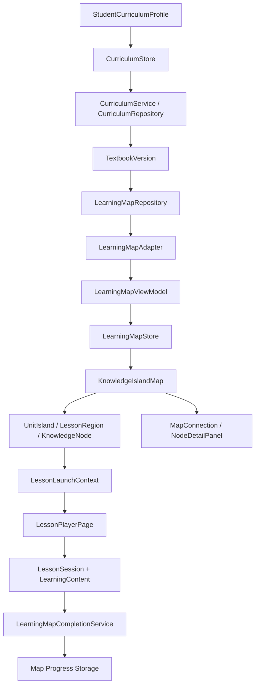

# 知识岛｜LearningMap 数据流

> 本文档记录 PHASE 7 的地图数据读取、适配、状态计算和页面消费路径，以及 PHASE 8 的 LessonPlayer 回链。Curriculum 是事实层，LearningMap 是展示层；本数据流不生成正式课程内容。

## 文档状态

| 项目 | 内容 |
| --- | --- |
| 当前阶段 | PHASE 8.4（继承 PHASE 7.4） |
| 状态 | 地图数据流与 LessonPlayer 回链已实现并验证 |
| 正式数据集 | `profile`，受生产访问策略保护 |
| 开发数据集 | `golden`、`demo`，仅开发路由 |
| 主要入口 | `src/services/learning-map/learningMapRepository.ts`、`learningMapAdapter.ts`、`src/stores/learningMapStore.ts` |

## 1. 主数据流



实际正式页面流程如下：

1. `curriculumStore` 读取当前 `StudentCurriculumProfile`。
2. `/learning-map` 取 profile 中的 `mathTextbookVersionId`；没有档案或教材时回到 Onboarding / 设置状态。
3. `learningMapStore.loadMap({ dataset: "profile", textbookId })` 请求地图仓储。
4. `MockLearningMapRepository` 调用 `CurriculumService.getLearningMapCurriculum(textbookId)`。
5. Curriculum Service 读取教材、年级、学期、学科、Unit、Lesson、课次-知识点映射、KnowledgePoint 与前置关系，并执行集中访问策略。
6. `buildLearningMapSourceFromDomain()` 生成不包含坐标、主题、颜色和 URL 的 `LearningMapCurriculumSource`。
7. `buildLearningMapViewModel()` 通过 Adapter 生成岛屿、区域、节点、连接线、逻辑布局、状态、完成度和诊断。
8. `learningMapStore` 读取当前教材的地图演示进度，重新构造 ViewModel，并维护选择 / 聚焦节点。
9. `KnowledgeIslandMap` 只消费 ViewModel；页面组件不直接 `filter` Curriculum 关系。

## 2. 开发数据流

```mermaid
flowchart LR
    A[/dev/learning-map] --> B{Dataset}
    B -->|profile| C[CurriculumService + AccessPolicy]
    B -->|golden| D[Golden Import Package]
    B -->|demo| E[Map Demo Fixture]
    C --> F[LearningMapAdapter]
    D --> F
    E --> F
    F --> G[LearningMapViewModel]
    G --> H[Dev Learning Map]
```

`golden` 使用当前唯一的 Golden Framework 验证导入包适配；它是 `UNVERIFIED`。`demo` 使用 `src/data/learning-map/demo/` 的三岛夹具验证多岛视觉、节点状态和跨区域关系；它是 `SAMPLE`。二者都只能由开发路由显式读取，不能作为正式地图的静默 fallback。

## 3. 模块所有权

| 模块 | 负责 | 不负责 |
| --- | --- | --- |
| `CurriculumStore` | 地区、年级、学期、三科教材和 StudentCurriculumProfile | 地图选中节点、地图布局、地图演示进度 |
| `CurriculumService` | 课程实体查询、地区教材解析、生产访问闸门 | 地图 CSS、节点位置、地图完成度 |
| `LearningMapRepository` | 按数据集取得地图课程输入 | Vue 页面状态、正式答题 |
| `curriculumSource.ts` | Domain / Import Package → 无视觉地图输入 | 生成随机布局、写回 Curriculum |
| `learningMapAdapter.ts` | Curriculum source → Unit / Lesson / Knowledge ViewModel | LessonPlayer 内容、Question、Mastery 算法 |
| `learningMapLayout.ts` | 根据稳定排序产生逻辑坐标 | 保存像素坐标到课程实体 |
| `learningMapUnlock.ts` | 纯函数计算锁定 / 可用 / 进行中 / 完成 | 根据分数推导 mastered / perfect |
| `learningMapStorage.ts` | 版本化地图进度载荷读写 | 保存正式 StudentProgress 或答题记录 |
| `learningMapStore.ts` | 地图加载、选择、聚焦、演示进度和刷新 ViewModel | 修改教材事实或课程审核状态 |
| `components/learning-map/` | 地图呈现、节点交互语义和显式 LessonLaunchContext 入口 | 拼装 Curriculum 关系、猜测教材 |

## 4. 关键转换

### 4.1 Curriculum source

`LearningMapCurriculumSource` 只保留地图所需的课程事实：教材展示快照、Unit、Lesson、KnowledgePoint、课次映射和 KnowledgeRelation。字段带 `isSample` / `verificationStatus` 供页面显示数据可信度；不包含 `position`、`visual`、`theme` 或真实媒体地址。

### 4.2 ViewModel

Adapter 为每个课次-知识点映射生成稳定的 `KnowledgeMapNode` ID：

```text
learning-map:{textbookId}:knowledge:{mappingId}
```

前置关系通过 KnowledgePoint ID 建立，再映射到节点连接。缺少 Unit、Lesson、KnowledgePoint 或关系端点时记录诊断并跳过无效项，不让整个页面白屏。

### 4.3 状态与完成度

ViewModel 建立后先套用地图进度，再计算 Lesson、Unit 和总体完成度。节点状态由 `learningMapUnlock.ts` 的纯函数确定；`mastered` / `perfect` 如果存在，只来自进度记录或 fixture，不来自 `masteryScore`。

## 5. 状态流

```text
loading
  ↓
source found → ViewModel built → ready
  ├─ no islands → empty
  ├─ no source / no supported curriculum → not_available
  └─ service exception → error
```

页面对上述状态提供儿童可理解的提示、返回或重试动作；开发数据额外显示 SAMPLE / UNVERIFIED 警示。诊断信息只在开发 / 可展开区域呈现，不泄露技术堆栈给儿童端。

## 6. PHASE 8 Lesson 边界

地图节点进入 LessonPlayer 时传递以下稳定 ID：

```ts
interface LessonLaunchContext {
  textbookId: string;
  unitId: string;
  lessonId: string;
  knowledgePointId: string;
}
```

PHASE 8 已实现 LessonPlayer 步骤、ContentBlock 渲染、LessonSession 恢复和地图完成回链；仍不实现 Question Engine、AnswerSubmission、QuestionSession、MasteryUpdate 或正式学习完成算法。
