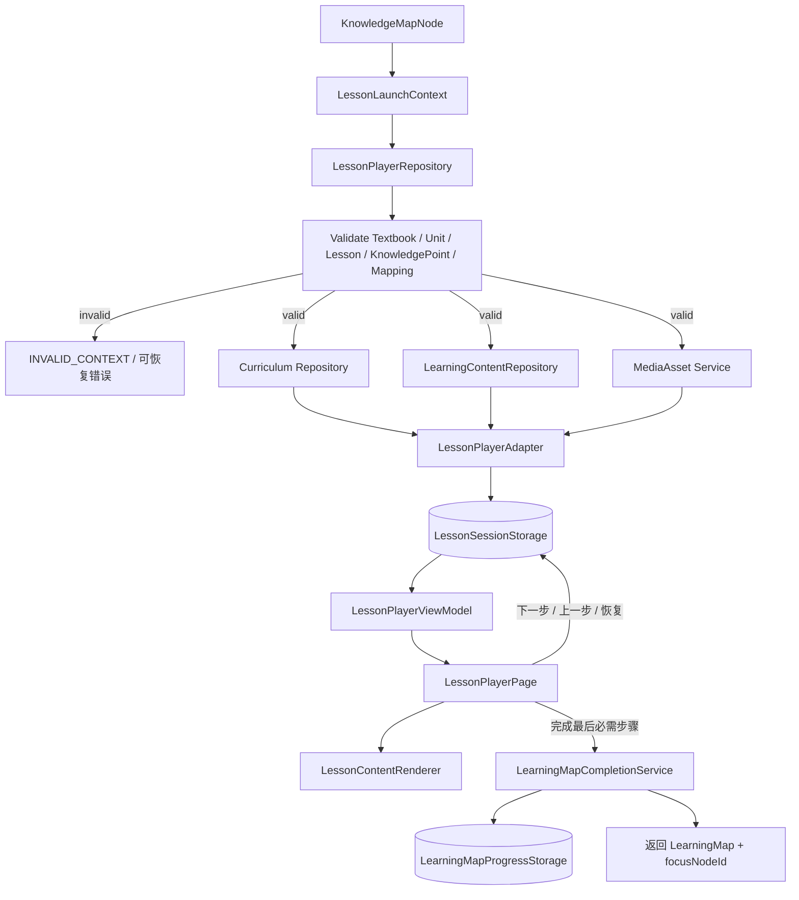

# 知识岛｜LessonPlayer 数据流

## 1. 主流程



## 2. 责任分工

| 部件 | 读取 / 写入 | 不负责 |
| --- | --- | --- |
| `LearningMapPage` | 生成显式 `LessonLaunchContext` 和回链参数 | 拼接课程内容、读取会话 |
| `LessonPlayerRepository` | 校验上下文、取得课程 / 内容 / 媒体数据 | 页面状态、步骤按钮 |
| `LearningContentRepository` | 从 `CourseContent` 取得可读 LearningContent | 判断题目、计算掌握度 |
| `LessonPlayerAdapter` | 生成排序稳定的 ViewModel | 写入课程事实 |
| `lessonPlayerStore` | 加载、恢复、导航、完成当前会话 | 地图布局、Question、Mastery |
| `lessonSessionStorage` | 保存多个版本化 LessonSession | 地图进度、教材事实 |
| `LessonContentRenderer` | 根据 block type 选择安全组件 | `v-html`、作答、评分 |
| `LearningMapCompletionService` | 将完成上下文写入地图演示进度 | 直接操作 `learningMapStore` |

## 3. 审核分支

```text
课程链有效
  ├─ LearningContent 不存在 / 无步骤 → empty 或 not_available
  ├─ 内容未通过正式闸门 → not_available
  ├─ 媒体缺失 / 失效 → 内容可继续，媒体显示 fallback
  └─ 内容可读 → 构建 ViewModel
```

课程审核和学习内容审核是两个独立判断。开发页可以通过明确的开发配置查看 SAMPLE / UNVERIFIED，但页面必须展示警示；该分支不会改变任何核验状态。

## 4. 页面回链

地图到学习页使用显式参数：

```text
/lesson
  ?textbookId=...
  &unitId=...
  &lessonId=...
  &knowledgePointId=...
  &mapNodeId=...
  &returnTo=/learning-map
```

开发地图使用 `/dev/lesson-player` 和 `returnTo=/dev/learning-map`。完成或退出不依赖浏览器后退来猜测来源；页面按显式 `returnTo` 与 `mapNodeId` 返回原地图节点。

## 5. Practice → Assessment 接入

Practice 步骤不嵌入题目数据。Question Engine 可用性由数据层根据当前 `LessonLaunchContext` 与 `QuestionKnowledgePoint` 关系检查；可用时，`PracticeBlock` 只发出 `start-assessment`，页面将完整上下文转换为：

```ts
interface AssessmentLaunchContext {
  textbookId: string;
  unitId: string;
  lessonId: string;
  knowledgePointId: string;
  source: "lesson_practice" | "dev";
}
```

Question Engine 完成后以 `assessmentCompleted=true` 和 `focusStep=summary` 返回 LessonPlayer。LessonPlayer 展示回链摘要并继续原有 LessonSession；Assessment 分数不写入地图完成度、课程事实或掌握度。

## 6. PHASE 8 / 9 边界

LessonPlayer 仍不拥有 Question Repository、答案提交或判题逻辑；这些责任属于独立 Question Engine。Question Engine 的结果只描述本次练习，不继续流向 `MasteryEvent`、`KnowledgeEnergy`、`WrongBook` 或 `Reward`。`masteryScore` 仍只受既定七种 `MasteryEvent` 影响，时间流逝由 `KnowledgeEnergy` 独立处理。
