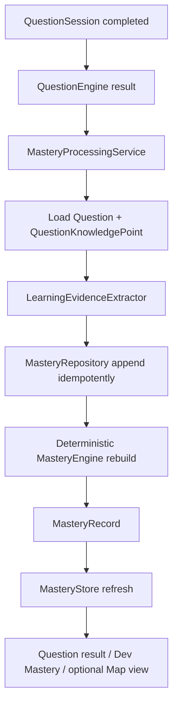

# 知识岛｜Mastery Data Flow

> 本文档记录 PHASE 10.3 的掌握度集成边界。完成度、作答结果和掌握度是三条不同状态链。

## 文档状态

| 项目 | 内容 |
| --- | --- |
| 所属阶段 | PHASE 10.3～10.4 |
| 状态 | QuestionSession 后处理、显式 Service 调用、错误隔离、Store 边界、地图展示投影和回归测试已实现并验证 |
| 实现入口 | `src/services/mastery/masteryService.ts`、`src/pages/QuestionEnginePage.vue` |

## 1. 主流程

Assessment 先完成并保存自己的 Session；随后由显式 `MasteryProcessingService` 读取已完成 Session。Question Store 不直接调用 Repository 写掌握度记录，不与 Mastery Store 互改。

## 2. Question Engine 集成

完成页在处理状态中区分：

- `idle`：尚未处理。
- `processing`：正在从 Session 派生证据并重算。
- `updated`：MasteryRecord 已写入并刷新。
- `error`：Assessment 仍保持 completed，只显示可恢复诊断。

已经完成的 Session 在恢复时可以再次触发处理；稳定证据 ID 和 Repository 去重保证幂等。处理失败不会删除答案、修改 Question、回退 Assessment 状态或改变地图解锁。

## 3. 影响边界

### 会被更新

- `masteryStorage` 中的 LearningEvidence 与 MasteryRecord。
- `MasteryStore` 的当前档案读取状态。
- 地图节点和 Node Detail 的可选掌握度展示投影。

### 不会被更新

- Question、QuestionAttempt 和 QuestionSession 原始事实。
- LessonSession、Lesson completion、LearningMapProgressRecord、MapNode status 和 prerequisite unlock。
- Curriculum、TextbookVersion、StudentCurriculumProfile 和内容审核状态。
- WrongBook、KnowledgeEnergy、Reward、XP、Streak 或任何自适应选择状态。

## 4. 失败与数据缺失

服务将孤儿题目、缺少知识点关系、未提交题、缺少结果和人工审核题保留为 diagnostic；可处理的其他题目仍可生成证据。没有可处理证据时不伪造分数。生产读取继续要求 Question 与关系通过集中审核闸门；开发样本则在记录和 UI 中明确标记。

## 5. 跨档案与跨教材

MasteryRecord 和 LearningEvidence 都按 `studentProfileId` 隔离，并以稳定 `knowledgePointId` 聚合。相同知识点在不同教材版本中的证据可以在同一学生档案下累计；本阶段不实现教材迁移 UI，也不自动合并不同学生或不同档案的记录。

## 6. 明确不在本阶段

本数据流不包含 Adaptive Learning、按掌握度选题 / 调难度、Review Scheduling、Spaced Repetition、KnowledgeEnergy、WrongBook、奖励、AI Tutor、AI Grading 或个性化学习路径。
