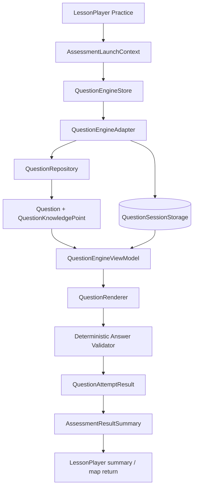

# 知识岛｜Question Engine 数据流

## 1. PHASE 9 主流程



正式和开发页面都必须先有完整的 `AssessmentLaunchContext`：`textbookId`、`unitId`、`lessonId`、`knowledgePointId` 和 `source`。正式入口只接收课程显式传入的上下文；开发入口可以使用固定 Demo Context，但不能从地区名称、标题或题干猜测关系。

## 2. 读取阶段

1. LessonPlayer 的 Practice 区域向页面发出 `start-assessment`。
2. 页面携带完整上下文和数据集参数进入 `/assessment` 或 `/dev/question-engine`。
3. Store 调用 Adapter 验证 Textbook、Unit、Lesson、KnowledgePoint 和 LessonKnowledgePoint 关系。
4. Adapter 从 Repository 读取 `AssessmentDefinition.questionIds`，保持题目顺序，并按目标 `knowledgePointId` 读取 `QuestionKnowledgePoint` 关系。
5. Adapter 执行 Question 独立审核闸门；缺少题目、关系、来源或可用状态时返回可恢复状态。
6. Adapter 将题目和历史 Attempt 适配为 `QuestionEngineViewModel`，页面只消费 ViewModel。

## 3. 作答阶段

- Renderer 只通过题型组件发出结构化 `QuestionAnswerDraft`。
- Store 保存未提交草稿，但不改变 Question 本体。
- 提交时 Validator 读取 Question 的 `QuestionAnswerRule`，输出 `QuestionAttemptResult`。
- Store 将 Attempt 与 `questionVersion` 一起保存，并锁定已提交输入。
- 下一题、上一题和完成动作都由 Store 的会话状态控制。

## 4. 返回阶段

全部题目提交后，Store 生成 `AssessmentResultSummary`。页面通过 `assessmentCompleted=true`、`focusStep=summary` 返回 LessonPlayer，LessonPlayer 只展示摘要并继续原有 LessonSession；需要回地图时仍使用显式的 `returnTo` 和 `mapNodeId`。

结果不会继续流向课程事实或学习算法：

```text
QuestionAttemptResult
  └─> AssessmentResultSummary
        └─> LessonPlayer summary

不会 ──> MasteryEvent / KnowledgeMastery / KnowledgeEnergy
不会 ──> WrongQuestion / Reward / Adaptive selection
```

## 5. 错误与恢复

`INVALID_CONTEXT`、`QUESTION_EMPTY`、`QUESTION_NOT_AVAILABLE`、`UNSUPPORTED_QUESTION` 和 Repository 错误都进入清晰的页面状态，不显示 `404`、`Null`、`Undefined` 或原始异常。Session 存储损坏时安全清理并从空白会话开始；孤儿 Attempt 在归一化时忽略并保留诊断。
