# 知识岛｜UI Flow 交互流程

> 本文档使用 Mermaid 描述页面与状态流。它是 UI 实现的导航依据；PHASE 7 的 LearningMap、PHASE 8 的 LessonPlayer、PHASE 9 的 Question Engine、PHASE 10 的 Mastery 后处理和 PHASE 11 的确定性策略提示已落到工程，其余成长与复习流程仍是设计规格。

## 文档状态

| 项目 | 内容 |
| --- | --- |
| 所属阶段 | PHASE 11.4：Learning Strategy（继承 PHASE 3 交互设计） |
| 状态 | PHASE 7 地图、PHASE 8 LessonPlayer、PHASE 9 Question Engine、PHASE 10 Mastery 后处理 / 辅助展示与 PHASE 11 策略卡片已实现并验证；KnowledgeEnergy 等复习算法仍未实现 |
| 上游事实源 | `PRODUCT.md`、`CURRICULUM.md`、`DATA_MODEL.md`、`PAGE_SPEC.md` |
| 数据解析 | `resolveAvailableTextbooks(regionId, gradeId, semesterId)`，确定性读取 |
| 保存事实 | 三科选择写入 `StudentCurriculumProfile`，不使用单一教材字段 |

---

## 1. Flow 总则

1. 首次配置是轻量游戏开场，不是后台表单或传统 Cascader。
2. 地区回答“在哪里学习”，年级回答“几年级”，教材回答“使用哪套课本”。
3. `Region`、`Publisher` 和 `TextbookVersion` 在每个流程节点保持分离。
4. UI 只消费数据层候选集和状态，不根据地区名称猜出版社或教材版本。
5. 三科独立解析、独立确认、独立保存；更换一科不会覆盖另外两科。
6. 返回上一页保留未完成草稿；保存失败不丢数据；取消修改不覆盖旧档案。
7. 课程内容未完成配置时不进入正式学习首页；已有有效配置的用户每次打开直接进入 Home。

## 2. Flow A：首次进入

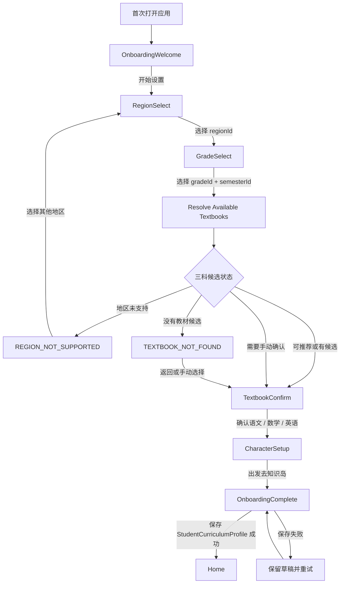

顶部只显示轻量进度：`1 / 4` 和“地区 · 年级 · 教材 · 角色”。每次进入应用不重复要求选择地区和教材。

### 2.1 地区内部流程

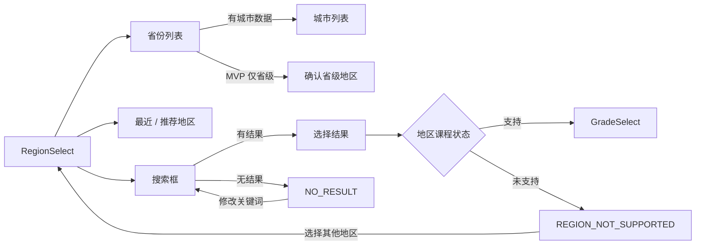

Desktop 可以省份 / 城市双栏；Mobile 逐级页面；MVP 没有城市数据时不展示城市入口。默认不用省 / 市 / 区传统三级 Cascader。

## 3. Flow B：已有配置

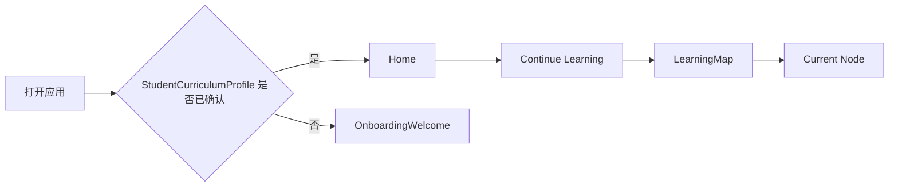

Home 首屏默认只展示“年级 · 学期”，例如“三年级 · 上册”；完整地区和三科教材在“我的学习设置”查看。

## 4. Flow C：学科入口与学习闭环

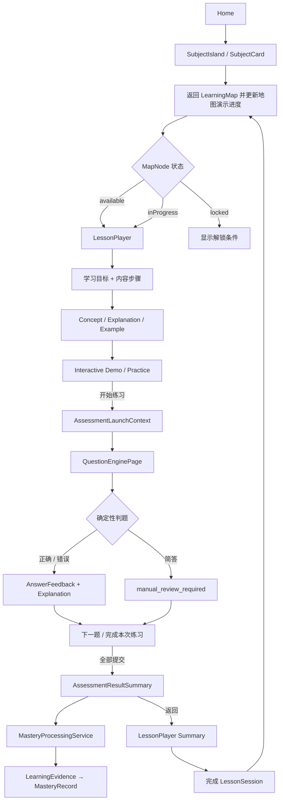

学科卡允许显示小型教材版本标签，但教材信息不能压过“继续学习”；地图顶部同时区分游戏主题和真实教材上下文。

## 5. Flow D：错误恢复

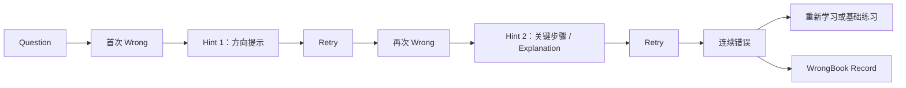

错误不跳题、不进入 `Game Over`。Question Engine 只保存 `QuestionAttemptResult`；完成 Session 后由独立 `MasteryProcessingService` 派生 `LearningEvidence` 和 `MasteryRecord`，错题记录、KnowledgeEnergy 和复习安排不由 Question Engine 生成。

## 6. Flow E：复习与知识能量

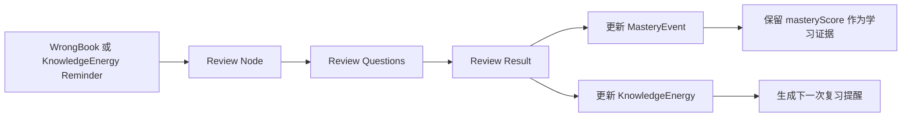

`masteryScore` 不因日期流逝自动下降；KnowledgeEnergy 单独处理复习时机。学生端使用“需要复习 / 快来充能”，不显示“记忆衰减率”。

## 7. Flow F：修改地区

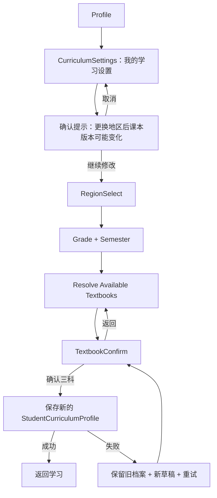

保存前不覆盖旧地区或旧教材；取消时旧档案继续生效。新的地区可能产生不同候选集，三科必须重新确认。历史学习记录不删除，迁移策略仍由产品 / 数据待确认项决定。

## 8. Flow G：修改单科教材

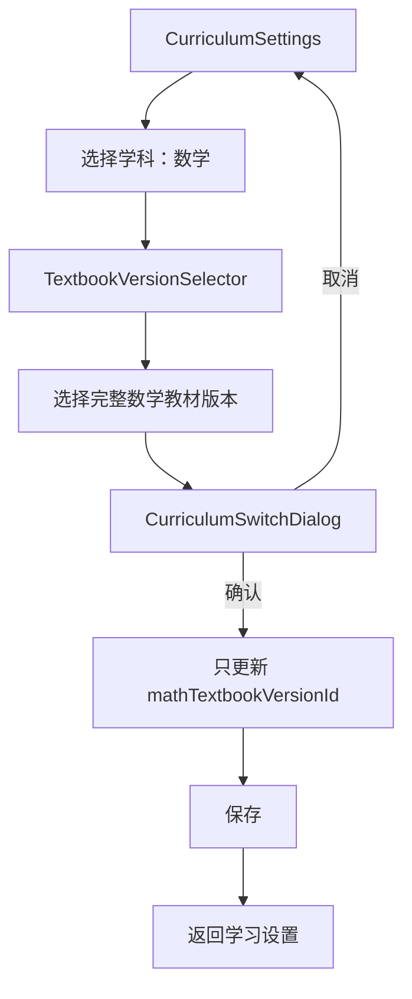

弹窗标题示例：“你正在更换数学课本”。内容必须显示当前版本、新版本和影响范围“仅数学”；语文和英语字段保持不变。

## 9. Flow H：修改年级

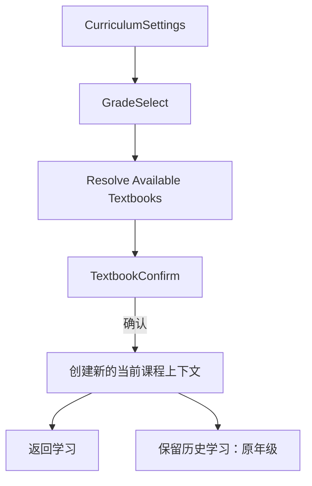

历史进度、作答、错题和旧教材上下文不删除。MVP 可以只保留“当前学习 / 历史学习”的 UI 和数据接口位置，不要求实现完整迁移。

## 10. Flow I：家长中心

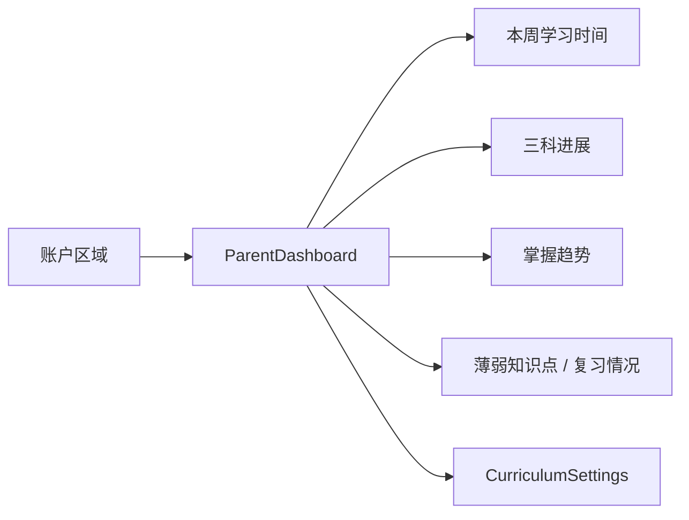

家长可以看到具体 `masteryScore`，但说明必须区分“学会了多少”和“多久没有复习”。不以全国排行作为主要目标。

## 11. Resolver 分支与页面动作

| 数据层结果 | 页面状态 | 允许动作 | 禁止动作 |
| --- | --- | --- | --- |
| 每科唯一有效 `DEFAULT` | `normal` + 推荐标签 | 显示推荐，保留确认动作 | UI 自行拼接名称 |
| 同科多个 `SUPPORTED` / `OPTIONAL` | `MULTIPLE_TEXTBOOKS` | 打开版本选择器，用户确认 | 按排序静默选第一项 |
| 无唯一 `DEFAULT` | `NO_DEFAULT_TEXTBOOK` / `TEXTBOOK_NEEDS_CONFIRMATION` | 看封面 / 出版社后手动选择 | 随机选择、AI 猜测 |
| 无可用候选 | `TEXTBOOK_NOT_FOUND` | 返回、手动确认入口、重试 | 进入空课程或伪造教材 |
| 地区未支持 | `REGION_NOT_SUPPORTED` | 选择其他地区 | 把出版社当作地区 |
| 年级未开放 | `GRADE_NOT_AVAILABLE` | 返回并选择支持年级 | 进入空页面 |
| 网络异常 | `error` / `offline` | 重试；有缓存时继续 | 显示 404、Null 或技术堆栈 |

每个学科独立执行分支。语文解析成功不代表数学或英语自动成功。

## 12. 保存、返回与恢复

### 12.1 Onboarding 草稿

- RegionSelect 选择成功后保存临时 `regionId`。
- GradeSelect 选择成功后保存 `gradeId`、`semesterId`。
- Resolver 结果作为当前配置草稿，不直接写成已确认 profile。
- TextbookConfirm 每科单独保存选中候选；三科完整后才允许进入完成页。
- CharacterSetup 保存角色外观，不改变课程选择。
- OnboardingComplete 成功后写入 `StudentCurriculumProfile.confirmedAt`。

### 12.2 修改流程草稿

- 进入地区 / 年级 / 教材修改时先复制当前 profile 为编辑草稿。
- 返回、取消或解析失败时旧 profile 继续生效。
- 保存成功后一次性提交新的 profile 快照；不静默覆盖旧历史。
- 保存失败显示可重试动作，并保留用户已选的三科版本。

## 13. 首页、地图与教材上下文

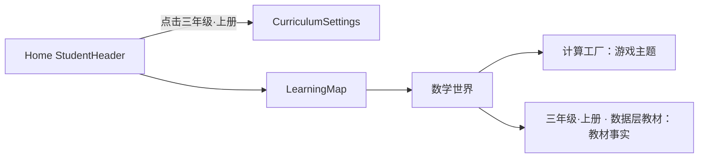

地图标题不能把游戏主题和教材单元拼成一个无法区分的标题。SubjectCard 可显示教材版本短标签，完整名称放入详情入口。

## 14. Flow 验收

1. 首次用户可以完成地区 → 年级 → 教材 → 角色 → 首页。
2. 已完成配置的用户再次打开直接进入 Home。
3. 地区存在多个教材时能手动确认，多个学科不会互相覆盖。
4. 无默认、无候选、未支持地区和未开放年级都有明确恢复路径。
5. 修改地区重新解析三科教材，取消不会静默切换旧配置。
6. 修改数学教材只更新数学，语文和英语保持不变。
7. 移动端地区逐级选择、教材卡片和版本选择可以单手完成。
8. 流程没有传统 Cascader 滥用、地区 / 出版社混淆或 UI 自行猜教材。
9. 学习闭环仍能在短路径内进入第一次互动，题目错误、结果和返回可恢复；掌握度、复习、奖励等后续域不被隐式触发。

## 15. PHASE 7 LearningMap Flow 实现状态

地图流程已实现为：

```text
StudentCurriculumProfile
  ↓
/learning-map
  ↓
Curriculum source → LearningMap ViewModel
  ↓
定位当前节点 → 点击节点 → Node Detail
  ↓
Start Demo / Complete Demo
  ↓
更新地图状态 → 解锁下一个 prerequisite 节点 → 保存地图进度
```

`/dev/learning-map` 额外提供 Golden Curriculum / Map Demo Fixture 切换、Reset Demo Progress 和状态 Showcase。`/learning-map` 没有有效课程档案时返回 Onboarding；没有可用课程数据时显示可恢复状态。地图节点现在把稳定 `LessonLaunchContext` 交给 LessonPlayer，不在页面中拼接课程数据。

## 16. PHASE 8 LessonPlayer Flow 实现状态

```text
KnowledgeMapNode
  ↓ 显式 textbookId / unitId / lessonId / knowledgePointId
LessonPlayerPage
  ↓
LessonPlayerRepository → LessonPlayerAdapter → LessonPlayerViewModel
  ↓
LessonSessionStorage（恢复 / 保存）
  ↓
内容步骤：Intro → Concept → Explanation → Example → Media → Interactive → Practice Placeholder → Summary
  ↓
Lesson completion
  ↓ 独立 LearningMapCompletionService
LearningMapProgressStorage → 返回地图并 focusNodeId
```

正式入口只允许通过课程、LearningContent 与 Question 审核闸门的内容；开发入口提供 Demo、Sample、Unverified、空、错误、未开放、恢复和完成状态 Showcase。PHASE 8 的 Practice 内容本身不提交答案；PHASE 9 的 Assessment 通过独立 Question Engine 提交和判题，但不写入 `MasteryEvent`；Lesson completion 与 Assessment completion 都不等于掌握度。

## 17. PHASE 9 Question Engine Flow 实现状态

```text
LessonPlayer Practice
  ↓ start-assessment
AssessmentLaunchContext
  ↓
/assessment 或 /dev/question-engine
  ↓
QuestionEngineStore → QuestionEngineAdapter
  ↓
固定 Assessment → QuestionRenderer → Answer Validator
  ↓
QuestionAttemptResult → AssessmentResultSummary
  ↓ assessmentCompleted=true + focusStep=summary
LessonPlayer Summary → LearningMap
```

已验证单选、多选、判断、填空、计算和简答六类题型；提交后输入锁定，简答保留人工审核状态。Session 使用独立版本化存储，页面不随机抽题、不猜教材、不修改 QuestionAttempt、KnowledgeEnergy、WrongBook 或 Reward；完成后显式触发的 Mastery 后处理也不改变地图完成度或解锁。

## 18. PHASE 10 Mastery Flow 实现状态

```text
QuestionSession = completed
  ↓
MasteryProcessingService
  ↓
LearningEvidence（按 QuestionKnowledgePoint.weight 拆分）
  ↓
MasteryEngine → MasteryRecord
  ↓
MasteryStore refresh
  ↓
Assessment Result / LearningMap Node Detail / /dev/mastery
```

掌握度页面使用“正在掌握 / 需要巩固 / 已掌握”等文字、图标和进度表达，不把 `masteryScore` 作为地图完成度，也不把日期流逝解释为能力下降。`manual_review_required`、未提交题、孤儿题目和缺少映射只显示 diagnostic。PHASE 10 不包含 Adaptive Learning、按掌握度选题、Review Scheduling、Spaced Repetition、KnowledgeEnergy、WrongBook 或 Reward。

## 8. PHASE 11 策略提示流

```text
Assessment completed
  ↓
Mastery refresh success?
  ├─ no  → 保持 completed + 可恢复诊断，不生成未知推荐
  └─ yes → LearningStrategyService（STRATEGY_V1）
              ↓
        Home / completion / LearningMap 轻量卡片
```

卡片只表达当前学习动作；Review 不是日程，锁定节点不被自动解锁。`/dev/strategy` 提供弱掌握、高分低置信度、正在掌握、已掌握、前置锁定、无可用节点、SAMPLE 与 UNVERIFIED Showcase。PHASE 11 已完成并停止，不进入 PHASE 12。
