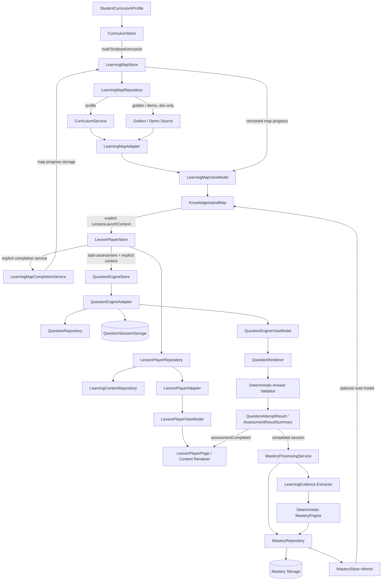

# 知识岛｜工程架构与 PHASE 16 边界

> 本文档记录当前 Vue 3 工程的模块边界和 PHASE 7～16 实现。它不是数据库架构或部署方案；课程事实、审核状态、题目协议、掌握度模型、学习策略、PHASE 12 学习行为投影、PHASE 14 首页聚合、PHASE 15 家长报告和 PHASE 16 生产门禁分别以 `DATA_MODEL.md`、`CONTENT_REVIEW.md`、`QUESTION_SCHEMA.md`、`MASTERY.md`、`LEARNING_STRATEGY.md`、`PHASE12.md`、`PHASE14.md`、`PARENT_REPORT.md` 和 `PHASE16.md` 为准。

## 文档状态

| 项目 | 内容 |
| --- | --- |
| 当前阶段 | PHASE 16.4：MVP Release Gate / Final Verification |
| 状态 | PHASE 7～15 领域已实现；PHASE 16 生产 Scope、来源清单、production index、内容/题目 readiness、迁移审计、QA、性能和发布门禁已实现；当前 Release Decision 为 `NOT_READY`，最终记录见 `PHASE16.md` 和 `MVP_RELEASE_REPORT.md` |
| 技术栈 | Vue 3、TypeScript strict、Vite、Pinia、Vue Router、Vitest |
| 生产原则 | 生产课程数据只允许 `verificationStatus = REVIEWED` |
| 开发原则 | SAMPLE / UNVERIFIED 只在显式开发数据集显示，并必须有警示 |

## 1. 分层

```text
src/
├─ types/
│  ├─ domain.ts                         # Curriculum / 内容 / 学习行为类型
│  └─ learning-map.ts                   # 地图 Presentation / Progress 类型
├─ data/
│  ├─ curriculum/                       # SAMPLE 与 Golden Curriculum 输入
│  └─ learning-map/demo/                # 多岛地图视觉夹具
├─ services/
│  ├─ curriculum/                       # 导入、核验、访问策略
│  ├─ adapters/mock/curriculumMockAdapter.ts
│  └─ learning-map/                     # source、adapter、layout、unlock、storage、repository
│  └─ lesson-player/                    # content、adapter、repository、session、地图完成接口
│  └─ question-engine/                  # repository、adapter、validator、session storage
│  └─ mastery/                           # evidence、engine、repository、storage、processing service
│  ├─ home/                              # Home 聚合、Daily Plan 投影与快照存储
│  └─ parent-report/                     # ParentReport 只读聚合与偏好存储
├─ stores/
│  ├─ curriculumStore.ts                 # 地区 / 年级 / 学期 / 三科教材 / profile
│  └─ learningMapStore.ts                # 地图 source、选择、聚焦、演示进度
│  └─ lessonPlayerStore.ts               # 学习上下文、ViewModel、会话和步骤状态
│  └─ questionEngineStore.ts             # Assessment、题目草稿、提交和结果状态
│  └─ masteryStore.ts                    # LearningEvidence、MasteryRecord 和展示读取状态
│  ├─ homeStore.ts                        # HomeViewModel、Daily Plan 和首页读取状态
│  └─ parentReportStore.ts                # ParentReport 筛选与家长报告读取状态
├─ components/learning-map/              # 地图视觉壳与可访问交互
├─ components/lesson-player/             # 内容块渲染与媒体回退
├─ components/question-engine/            # 六类题型渲染、媒体与反馈
├─ pages/
│  ├─ LearningMapPage.vue                # 正式 /learning-map
│  ├─ DevLearningMapPage.vue             # 开发数据集与状态 Showcase
│  ├─ LessonPlayerPage.vue               # 正式 /lesson 与开发 /dev/lesson-player
│  ├─ QuestionEnginePage.vue              # 正式 /assessment 与开发 /dev/question-engine
│  ├─ HomePage.vue                        # 正式 /home、/tasks 与开发 /dev/home
│  └─ ParentDashboardPage.vue             # 正式 /parent 与开发 /dev/parent-dashboard
└─ styles/                               # 地图与学习步骤场景、状态和响应式样式
```

## 2. 责任边界

| 层 | 权威 / 责任 | 禁止承担 |
| --- | --- | --- |
| Curriculum Domain | 教材、Unit、Lesson、KnowledgePoint、关系、来源与核验 | 视觉坐标、岛屿主题、地图完成度 |
| Curriculum Service | 按地区 / 学段查询和生产访问保护 | Vue 组件关系拼装、地图状态 |
| LearningMap Source | 为地图提供不含视觉字段的课程快照 | 猜教材、修改课程数据 |
| LearningMap Adapter | 生成 UnitIsland、LessonMapSection、KnowledgeMapNode、Connection 和诊断，并可附加掌握度读取投影 | LessonPlayer 内容、Question、Mastery 计算或解锁规则 |
| LearningMap Store | 地图加载、选择、聚焦和开发演示进度 | 修改教材或 StudentCurriculumProfile |
| LessonPlayer Repository / Adapter | 校验 `LessonLaunchContext`，读取课程内容并生成 LessonPlayer ViewModel | 猜教材、绕过内容审核、拼接题目或掌握度 |
| LessonPlayer Store | 学习会话、步骤导航、恢复、完成和独立会话存储 | Question Engine、作答评分、Mastery、Reward |
| LessonPlayer Completion Service | 通过稳定上下文把已完成学习映射到地图进度 | 直接依赖或修改 `learningMapStore` |
| Question Repository / Adapter | 依据显式 `AssessmentLaunchContext` 读取固定题目集合、关系和审核状态 | 随机抽题、猜教材、模型推荐、写入掌握度 |
| Question Engine Store | 题目草稿、提交锁定、QuestionSession、恢复和 Assessment 结果；完成后发起显式处理 | 修改 Question 本体、直接改写 Mastery Store、KnowledgeEnergy、WrongBook、Reward |
| Question Renderer / Validator | 渲染结构化题目并按数据规则确定性判题 | `v-html`、AI 判题、隐式部分分或隐式学习事件 |
| MasteryProcessingService | 从已完成 QuestionSession 提取 LearningEvidence，调用确定性 MasteryEngine，持久化并刷新 MasteryRecord | 读取 Lesson / Map completion 作为直接证据、改写 QuestionSession / Curriculum / Map progress |
| MasteryEngine | 按固定权重、结果和集中策略重算 MasteryRecord | 时间衰减、复习排程、自适应选题、奖励或模型推断 |
| MasteryRepository / Storage | 独立保存证据和掌握度记录，负责版本、迁移、幂等和损坏回退 | 合并 lesson、question、map 或 reward 存储 |
| LearningMap Components | 呈现地图、连接线、状态、详情面板和可访问交互 | 读取原始 Curriculum 数组、推断课程事实 |
| LessonPlayer Components | 呈现 ViewModel 内容块、媒体 fallback 和非评分互动 | `v-html`、答案提交、自动判题 |
| HomeService | 聚合既有只读服务，生成 HomeViewModel 并请求 Daily Plan snapshot | 重新计算 Mastery / Strategy、直接写上游领域事实 |
| DailyPlanProjection | 按集中 Policy 组合五类任务、去重、冻结 identity 并解析完成状态 | 新增学习算法、自动解锁、自动生成路径或修改 Strategy |
| DailyPlanStorage / Service | 保存 schemaVersion 1 的每日快照，处理隔离、校验和损坏回退 | 保存 QuestionAttempt、Mastery、Reward 或跨 Profile 数据 |
| Home Store / Page | 读取首页 ViewModel，发出显式 CTA 和 returnTo 上下文 | 直接读取底层 storage、把按钮点击当成完成事实 |
| ParentReportService | 只读读取既有学习事实，按 Profile / 日期 / 学科聚合 `PARENT_REPORT_V1`，返回 partial result 与 diagnostics | 写 Mastery、Strategy、Daily Plan、WrongBook、Review Queue、Reward、Achievement、Question 或学习历史 |
| ParentReportStore / Page | 保存报告筛选偏好，读取 ParentReport，提供到孩子端地图 / 错题 / 巩固页的导航 | 自动完成任务、Resolve WrongBook、修改 Review priority、生成综合评分或学习建议 |
| Router / Pages | 入口保护、数据集选择和状态展示 | 绕过生产访问策略 |

## 3. 运行数据流



正式地图只走 `profile` 数据集，开发页才可以切换 `golden` / `demo`。`LearningMapViewModel` 是地图页面唯一输入；`LessonPlayerViewModel` 是学习页面唯一输入。两个 ViewModel 把课程事实、地图展示状态和学习会话分开，避免页面重复做关系查询。

## 4. PHASE 7 模块

### 4.1 Curriculum source 与 Adapter

`curriculumSource.ts` 将 Domain 或 Golden Import Package 转为 `LearningMapCurriculumSource`。该输入保留稳定 ID、标题、排序、关系和 `isSample` / `verificationStatus`，不包含 `position`、`theme`、URL 或 CSS。

`learningMapAdapter.ts` 负责：排序、节点 ID 生成、前置索引、连接线端点、视觉注册表、稳定布局、进度套用和缺失引用诊断。

### 4.2 纯函数

- `learningMapLayout.ts`：相同输入产生相同逻辑坐标。
- `learningMapProgress.ts`：计算节点、Lesson、Unit 和地图完成度。
- `learningMapUnlock.ts`：根据稳定 KnowledgePoint ID 解析锁定 / 可用 / 进行中 / 完成。
- `learningMapStorage.ts`：读取 / 写入版本化地图进度载荷。

`mastered` / `perfect` 不在地图纯函数中由分数产生；`mastered` 是 MasteryRecord 的学习状态，`perfect` 仍只能作为地图 Presentation fixture / mock 状态被保留。Mastery 不参与地图解锁。

## 5. PHASE 8 LessonPlayer 模块

### 5.1 领域与状态

`LessonStep` 是最小导航单位，`LessonSession` 是学生在一个完整课程上下文中的本地可恢复状态。会话 ID 按 `studentId + textbookId + unitId + lessonId + knowledgePointId` 确定性生成，不使用 `Math.random()` 或 `Date.now()` 作为身份。会话载荷独立存放为 `{ schemaVersion: 1, sessions }`，不写入 `learningMapStore`。

`LessonPlayerRepository` 先验证 Textbook → Unit → Lesson → KnowledgePoint → LessonKnowledgePoint 映射，再读取 `LearningContent`。Curriculum 已 `REVIEWED` 但 LearningContent 未 `REVIEWED` 时仍不可用于正式入口；开发页可在显式配置下查看 SAMPLE / UNVERIFIED 并显示警示。

### 5.2 内容渲染

`LessonContentRenderer` 根据 `LessonContentBlockViewModel.type` 注册 Intro、Concept、Explanation、Example、Media、Interactive、Practice 和 Summary 组件，未知类型显示开发诊断占位。渲染器只使用安全文本节点与显式媒体属性，不使用 `v-html`；互动不表达答案、评分或正确 / 错误结果。

### 5.3 页面与完成联动

正式 `/lesson` 只接受显式的四个上下文 ID，开发 `/dev/lesson-player` 提供 Demo Fixture 与状态 Showcase。页面支持加载、空内容、暂未开放、错误、Sample、Unverified、恢复和完成状态；完成时调用独立 `LearningMapCompletionService`，服务写入地图进度存储，之后返回地图并聚焦原节点。

## 6. 入口与访问保护

| 入口 | 作用 | 访问边界 |
| --- | --- | --- |
| `/learning-map` | 学生正式地图入口 | 需要已完成 profile；课程 Service 只允许生产可读数据 |
| `/dev/learning-map` | Golden / Demo 预览 | 开发工具，显示 SAMPLE / UNVERIFIED 警示 |
| `/dev/learning-map/states` | 六种节点状态 Showcase | 开发工具，mastered / perfect 仅为 fixture |
| `/map/:mapId` | 历史兼容入口 | 重定向到 `/learning-map`，不另建地图状态 |

没有 profile 时正式入口由路由保护回到 Onboarding；没有可用 source 时页面进入 `not_available` / `empty` 等可恢复状态。Golden 不作为正式回退。

## 7. PHASE 9 Question Engine 模块

### 7.1 领域与读取

`QuestionEngineAdapter` 接受显式 `AssessmentLaunchContext`，先校验课程上下文，再通过 `QuestionRepository` 读取 `AssessmentDefinition.questionIds` 和 `QuestionKnowledgePoint` 关系。Demo Assessment 是固定六题顺序；正式数据继续服从 Question 独立审核闸门。页面不根据地区、标题或题面猜测教材与知识点。

### 7.2 会话与判题

`questionEngineStore` 通过独立 `questionSessionStorage` 保存草稿、提交状态、结果、题目版本和当前位置。`QuestionRenderer` 只消费 `QuestionViewModel`；`answerValidator` 负责选择、多选、判断、填空、计算和简答的确定性结果。提交后输入锁定，简答题标记人工审核，不自动产生 `MasteryEvent`。

### 7.3 明确隔离

Assessment 结果只描述当前题目集合；完成的 `QuestionSession` 由页面 / Store 显式调用 `MasteryProcessingService`。Question Store 不直接写入 Mastery Store；处理失败只显示可恢复诊断，不能把已完成 Assessment 改回未完成。`MasteryRecord.masteryScore` 不做时间衰减，遗忘 / 复习提醒属于尚未实现的独立 `KnowledgeEnergy` 域。

## 8. 质量边界

PHASE 7 已覆盖适配器、布局、解锁、存储、空态 / unsupported、Sample / Unverified 标识、组件可访问性、Reduced Motion、响应式和浏览器冒烟。PHASE 8 继续覆盖 LessonPlayer 领域、会话存储、内容块渲染、状态 Showcase、地图回链、响应式与浏览器冒烟。测试和验证结果见 `LEARNING_MAP.md`、`LEARNING_MAP_VISUAL.md`、`LESSON_PLAYER.md` 和 `LESSON_SESSION.md`。

PHASE 9 已覆盖 Question Domain、固定 Assessment、六类题型渲染、确定性判题、草稿与结果恢复、生产题目闸门、LessonPlayer 回链、Sample / Unverified 状态、响应式、键盘可访问性、结果语义和 Reduced Motion。验证记录见 `QUESTION_ENGINE.md`、`QUESTION_SESSION.md`、`QUESTION_VALIDATION.md`、`ASSESSMENT.md` 与 `LESSON_PLAYER.md`。

## 9. PHASE 10 Mastery 模块

PHASE 10.1～10.4 已实现并停止。`LearningEvidence` 只从已完成 `QuestionSession` 中的已提交、可确定判定的 `QuestionAttempt` 派生；多知识点题目按 `QuestionKnowledgePoint.weight` 产生多条证据。`manual_review_required`、未提交题、孤儿题目和缺失映射不产生正确 / 错误证据。

`MasteryEngine` 是无副作用的确定性聚合器：按知识点权重、难度权重和集中策略计算 `masteryScore`、`confidence` 与 `KnowledgeLearningState`，并持久化 `algorithmVersion`。它不读取时钟、最近学习时间、连续天数、地图完成、Lesson completion、奖励或任何模型输出。`masteryStorage` 使用独立的 schemaVersion 1 载荷，损坏 / 未知版本安全回退并保留 warning；重放与重复 Session 处理幂等。

地图可读取掌握度 ViewModel 作为辅助展示，但地图完成度、节点 status、前置解锁和教材主链不受 Mastery 改写。PHASE 10 不实现 Adaptive Learning、按掌握度选题、Review Scheduling、Spaced Repetition、WrongBook、KnowledgeEnergy、Reward、AI Tutor、AI Grading 或个性化学习路径。实现与验证记录见 `MASTERY.md`、`MASTERY_MODEL.md`、`MASTERY_DATA_FLOW.md`、`LEARNING_EVIDENCE.md` 和 `MASTERY_STORAGE.md`。

## 10. PHASE 11 Learning Strategy 模块

PHASE 11 的运行链为：

```text
QuestionSession completed
  ↓ MasteryProcessingService
MasteryRecord refresh
  ↓ LearningMapViewModel + existing map status
LearningStrategyService（STRATEGY_V1）
  ↓
LearningRecommendation / ReviewRecommendation
  ↓
Home / Assessment completion / LearningMap / /dev/strategy
```

`StrategyEngine`、`ReviewStrategy` 和 `NextLearningResolver` 都是只读、确定性服务；`learningStrategyStore` 只保存推荐读取状态。它不拥有 `MasteryRecord` 或地图进度写权限，三个上游 Store 也不直接写它。

策略使用已有 MasteryPolicy 阈值和已由地图服务解析的节点状态。它不重新发明 prerequisite 解锁，不把分数写回地图，不改变 `MapNode.status` / `progress`，也不把 `mastered` 自动解释为地图 `completed`。

生产入口单独检查课程关系、地图节点、教材上下文和证据来源；SAMPLE / UNVERIFIED / REJECTED 只可在开发数据集显示并带警示。Review 是当前巩固建议，不是 Review Scheduling。AI Learning Path、Spaced Repetition、KnowledgeEnergy、WrongBook 规则和 Reward 均不在 PHASE 11；PHASE 12 的独立行为投影见下一节。

实现与验证记录见 `LEARNING_STRATEGY.md`、`REVIEW_STRATEGY.md`、`STRATEGY_DATA_FLOW.md` 和 `tests/learning-strategy.test.ts`。

## 11. PHASE 12 Learning History / WrongBook / Review Queue

PHASE 12 在既有主链之后增加三个独立的学习行为投影：

```text
LessonSession ───────────────→ LearningHistoryStore
QuestionSession ─────────────→ LearningHistoryStore
QuestionAttempt ─────────────→ WrongBookProjectionService
MasteryRecord → Strategy V1 ─→ ReviewQueueProjectionService
```

`learningHistoryStore`、`wrongBookStore` 和 `reviewQueueStore` 各自拥有独立的 schemaVersion 1 本地存储。History 是 append-oriented 事实记录；WrongBook 以 `profileId + questionId` 聚合错误；Review Queue 保存 Strategy 的当前建议快照。三者都隔离 `profileId`、`textbookId` 和 SAMPLE 来源。

Question Engine 只在提交后显式调用 WrongBook 投影，草稿、正确、人工判断、孤儿、unsupported 和无结果 Attempt 不进入错题本。错题重练通过 `AssessmentLaunchContext.source = 'wrong_book'` 和新的 `sessionScope` 产生新的 QuestionSession，原 Session / Attempt 不被覆盖。Strategy 仍只读，Review Queue 不反向修改 Mastery、Strategy、地图解锁或题目集合。

正式页面为 `/history`、`/wrong-book`、`/review-queue`，开发页面为 `/dev/history`、`/dev/wrong-book`、`/dev/review-queue`。生产页面显式排除 SAMPLE；开发 / Golden 数据可以展示，但必须保留来源警示。详细字段、存储、投影和排除项见 `PHASE12.md`、`LEARNING_HISTORY_DATA_FLOW.md`、`WRONG_BOOK_DATA_FLOW.md` 和 `REVIEW_QUEUE_DATA_FLOW.md`。

## 12. PHASE 13 Reward / KnowledgeEnergy / Achievement Growth

PHASE 13 在 PHASE 12 的回顾事实之上增加独立的动机反馈层：

```text
completed Lesson / Assessment / Mastery transition / Review / WrongBook
                              ↓
                    RewardEvent (REWARD_V1)
                              ↓
                    KnowledgeEnergy / GROWTH_V1
                              ↓
                    AchievementProgress (ACHIEVEMENT_V1)
```

Reward 只读取完成事实。它不写 Mastery、Strategy、LearningMap unlock、Question difficulty、Review priority 或任何上游 Session / Attempt。Energy 是累计反馈值，不是货币，也不是 `masteryScore`；Growth 只用于反馈，不参与 Curriculum Progress。正式入口过滤 SAMPLE，开发 `/dev/reward` 显式展示 SAMPLE 并保留来源标识。

RewardEvent、Energy snapshot、Growth snapshot 和 Achievement unlock 使用独立 schemaVersion 1 本地存储；RewardEvent 是 Energy 的可追溯事实，snapshot 损坏时从事件重建。实现与停止点见 `PHASE13.md`、`REWARD_DATA_FLOW.md`、`GROWTH_DATA_FLOW.md` 和 `ACHIEVEMENT_DATA_FLOW.md`。

## 13. PHASE 14 Home / Daily Learning Loop

PHASE 14 是应用聚合层。`HomeService` 读取 Profile、Curriculum、LearningMap、LessonSession、QuestionSession、`STRATEGY_V1`、LearningHistory、WrongBook、Review Queue、Growth 和 Achievement，生成一个 `HomeViewModel`；`HomePage` 不直接访问任何底层 Storage。

```text
既有 Domain facts
        ↓
HomeService
        ├─ DailyPlanProjection（DAILY_PLAN_V1）
        └─ HomeViewModel
                ↓
            HomeStore → HomePage
```

Daily Plan 只组合 `continue_learning`、`review`、`reinforce`、`wrong_question` 和 `next_learning` 五类任务。默认 Policy 最多 3 项，优先级与去重规则集中在 `dailyPlanProjection.ts`；Review / Reinforce / Next 的同教材 KnowledgePoint 去重只是 UI 组合，不是第二套 Strategy。每日首次生成后冻结任务 identity，刷新只同步上游事实产生的 status、progress 和可用性。

`/home`、`/tasks` 和 `/dev/home` 分别是正式首页、今日学习入口和开发样本入口。首页 CTA 传递显式 Lesson / Assessment context 或 focus query，完成后重新读取各自领域状态，不能由 Home 自己写 `completed = true`。Daily Plan 使用独立 schemaVersion 1 存储、Profile / 教材 / dataset 隔离和 Zod 损坏回退；正式入口排除 SAMPLE / UNVERIFIED / REJECTED，开发样本必须保留来源提示。

实现与数据流见 `PHASE14.md`、`DAILY_PLAN_DATA_FLOW.md` 和 `HOME_DATA_FLOW.md`。

## 14. PHASE 15 Parent Dashboard / Learning Report

PHASE 15 是家长侧的只读 Reporting / Aggregation Layer，不是 Learning Decision Layer，也不是 Parental Control System。`ParentReportService` 通过既有 Repository、Service 和公开读取接口聚合事实；页面不读取组件临时 state，不直接扫描 UI Store 内部实现。

```text
LearningHistory ─────┐
MasteryRecord ───────┤
STRATEGY_V1 read ────┤
WrongBook ────────────┤
ReviewQueue ──────────┤
DailyPlan ────────────┤ → ParentReportService → ParentReportStore
Reward / Growth ──────┤                                  ↓
Achievement ──────────┘                         ParentDashboardPage
```

报告版本为 `PARENT_REPORT_V1`，身份由 `profileId + range.startDate + range.endDate + reportVersion` 确定性生成。日期范围支持最近 7 天、最近 30 天和全部记录；业务日期按用户本地日历处理，报告生成时间通过读取选项注入，避免业务计算依赖不稳定时钟。

`ParentReportService` 的输出包括 Overview、Subject Summary、Mastery Distribution、Weak Knowledge、WrongBook、Review、Daily Plan Completion、Activity、Growth、Achievement 和轻量 Trend。它只消费已发生的完成事实和现有 `STRATEGY_V1` 建议，不创建新的 QuestionAttempt、LearningEvidence、History、RewardEvent、AchievementUnlock 或 Review completion。掌握度只显示具体 KnowledgePoint 或状态分布，不生成综合伪分数；系统没有可信 duration 时不显示学习时长。

正式 `/parent` 只使用 profile 数据并过滤 SAMPLE / UNVERIFIED / REJECTED 与样本派生事实；`/dev/parent-dashboard` 可显示内存中的 Full、Empty、Sample、Unverified、Weak-heavy、No WrongBook、No Review、Partial 和 Error 场景。开发夹具不写入孩子端事实存储。正式页 CTA 只导航到 `/learning-map`、`/wrong-book` 和 `/review-queue`，不代替孩子完成任何动作。

报告偏好单独使用 schemaVersion 1 的本地存储，仅保存 range 与 subject filter。Zod 校验失败或存储损坏时回退默认偏好并给出诊断；不存在第二套 Parent Mastery、Parent Strategy 或复制事实的 Storage。

详细字段、聚合、隐私与数据流见 `PARENT_REPORT.md`、`PARENT_REPORT_DATA_FLOW.md`、`PARENT_DASHBOARD.md` 和 `REPORT_PRIVACY.md`。

## 15. PHASE 16 Production Readiness / MVP Release

PHASE 16 在既有学习闭环之后增加真实课程发布前的证据、范围和工程门禁，不重新设计任何既有 Domain：

```text
Source Manifest + Manual Review
              ↓
       MVP Curriculum Scope
              ↓
 Production Curriculum Index
       ├─ Reviewed Content
       └─ Reviewed Questions
              ↓
      Existing product runtime
```

`MVP Curriculum Scope` 是显式发布 allow-list。只有 `RELEASED` scope entry、`REVIEWED + ACTIVE` Curriculum、`REVIEWED + PUBLISHED` Content / Question、有效来源和完整关系才可以进入 `productionCurriculumIndex`。候选、`UNVERIFIED`、`VERIFIED` 和 SAMPLE 记录可以用于导入差异检测或开发展示，但不能被正式入口读取。

当前生产数据集是有意为空的 allow-list：仓库尚无可靠的 2026—2027 深圳当前教材选用证明、同版次原书/版权证据、人工审核记录和正式内容/题目覆盖。因此 `MVPReleaseGate` 返回 `NOT_READY`，而不是把 Golden framework 或 SAMPLE fixtures 标记为已发布。

生产配置在 `src/config/production.ts` 集中解析；生产模式强制关闭所有 SAMPLE / 未审核开关和 Dev routes。`src/services/runtime.ts`、Lesson Content Repository、Question Repository 和 Content Service 在生产模式显式读取 production index。Router 对产品、家长和 Dev 页面使用 route-level lazy loading，`/dev/*` 在生产模式不可导航。

`ProductionReadinessValidator` 负责 Scope、来源、地区教材关系、内容/题目覆盖、媒体版权和 SAMPLE leak 检查；`MVPReleaseGate` 汇总它与 Engineering、QA、Regression 结果。Storage migration matrix 和 orphan recovery 只提供安全回退，不改变 `MASTERY_V1`、`STRATEGY_V1`、`DAILY_PLAN_V1` 或 `PARENT_REPORT_V1`。

实现与停止点见 `PHASE16.md`、`MVP_CURRICULUM_SCOPE.md`、`CURRICULUM_SOURCE_MANIFEST.md`、`PRODUCTION_READINESS.md`、`STORAGE_MIGRATION_MATRIX.md`、`PERFORMANCE_REPORT.md`、`MVP_RELEASE_CHECKLIST.md` 和 `MVP_RELEASE_REPORT.md`。PHASE 16 完成后停止，不进入 PHASE 17。

## 16. CONTENT SYSTEM EXPANSION 01：KnowledgePoint Experience Layer

内容扩展层在 KnowledgePoint 结构之上提供独立的学习体验，不向 `Textbook`、`Unit`、`Lesson` 或 `KnowledgePoint` 增加活动字段：

```text
KnowledgePoint
  ↓
ContentExpansionRepository
  ├─ LearningContent
  ├─ InteractiveActivity → ActivityResult → ActivityProgressStorage
  ├─ PracticeSet → ExerciseTemplate → ExerciseInstance
  │                                  ↓ adapter
  │                         QuestionSession / QuestionAttempt
  ├─ ExtensionActivity
  └─ Challenge
```

`src/services/interactive-activity/` 负责 registry、renderer contract、progress service 和 schemaVersion 1 存储；`src/services/exercise-template/` 负责受约束种子生成、实例校验和 Question adapter；`src/services/content-expansion/` 负责 Bundle、PracticeSet 读取和完整性检查。`interactiveActivityStore` 是独立 Store，不并入 LessonPlayer、QuestionEngine、Mastery 或 Strategy Store。

Activity Engine 当前注册 12 类活动，首版实现 6 个 Vue renderer；未实现类型只显示安全占位。拖拽类通过 Pointer Events 和按钮键盘替代完成，不依赖 HTML5 Drag API 或游戏引擎。`select_region` 使用 normalized logical coordinates，`simulation` 使用 `templateKey + typed parameters`，不执行脚本。

Exercise Template Engine 当前聚焦 G1 Math，使用 `templateId + seed + index` 生成稳定实例 ID。实例必须经过 `GeneratedQuestionAdapter` 才能进入现有 Question Engine；生成本身不产生 QuestionAttempt、LearningEvidence、Mastery、History、WrongBook 或 Reward。正式生成入口要求 `REVIEWED + isSample=false`。

Golden Bundle 当前包含 4 个 `SAMPLE + UNVERIFIED` 一年级数学候选知识点，只能从 `/dev/content-expansion` 和 `/dev/activity-engine` 读取。正式 profile 仓储会过滤这些记录，LessonPlayer 只通过开发态 KnowledgePoint Hub 展示摘要入口。

本扩展不修改 `MASTERY_V1`、`STRATEGY_V1`、`DAILY_PLAN_V1`，不进入 Grade 2 或 PHASE 17。详细契约见 `CONTENT_SYSTEM_EXPANSION_01.md`、`INTERACTIVE_ACTIVITY_ENGINE.md`、`EXERCISE_TEMPLATE_ENGINE.md`、`PRACTICE_SYSTEM.md` 和 `GOLDEN_CONTENT_G1_MATH.md`。

## 17. Education Agent Foundation

PHASE 17 在既有事实层上增加只读 Context / StudentKnowledgeState、确定性 LearningPlanner、生成与校验协议、AnswerAnalyzer、Orchestrator 和 Trace。STRATEGY_V1 仍提供候选；Mastery 仍由原 Evidence / MASTERY_V1 处理。开发模拟通过现有 QuestionSession / Attempt / Evidence 协议验证闭环，并向 WrongBook、History、Review 的独立内存适配器投影。正式学生页面未接入，AI supplement 不进入 Production Curriculum。具体 API、规则优先级、来源闸门、存储兼容和限制见 [PHASE17](../history/PHASE17.md)。


## PHASE 18.1–18.3：受约束 LLM 生成

在原 QuestionGeneratorProvider 后增加 AIQuestionGenerator → 通用 LLMRuntime → 服务端 OpenAI-compatible Adapter。仅本机开发 BFF 持有配置和 Key；客户端不依赖具体厂商。Prompt Registry / Zod 输出经原 GeneratedQuestionValidator 增量验证，保留有效题后有界修复、显式回退。Planner、课程来源闸门、Mastery / Evidence 归属不变。配置、协议、故障语义与验证限制见 [PHASE18](../history/PHASE18.md)。
